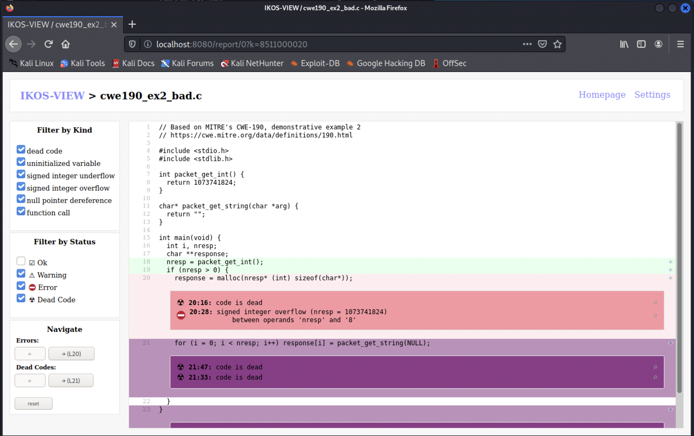
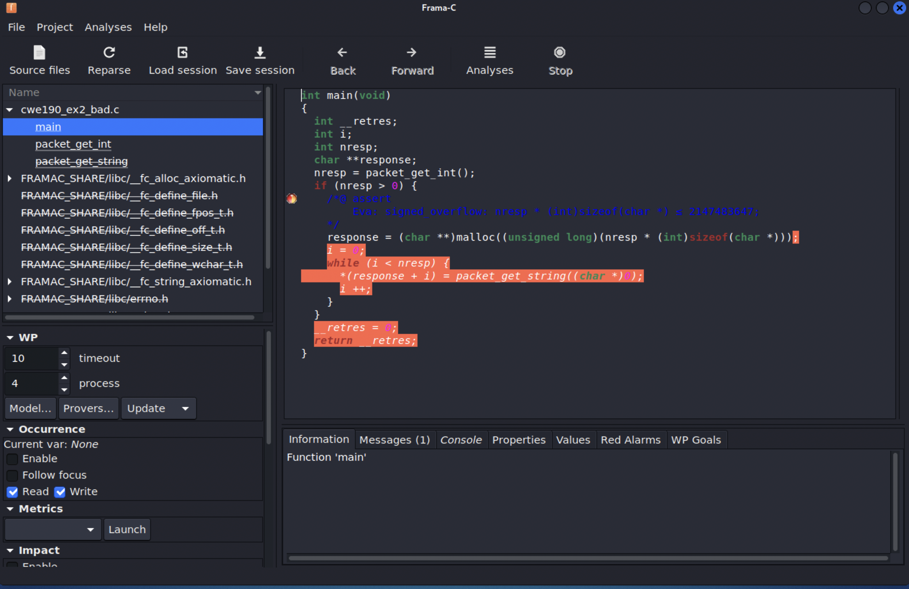

# Lab 1 - Low-level security

One of the most common source vulnerabilities, even to this day, remains to be related to exploits for low-level programming languages such as C or C++. C and C++ are very insecure and error-prone languages, and one of the main sources of problems is memory access errors. For instance, many of the [2021 Top 25 CWEs](https://cwe.mitre.org/top25/archive/2021/2021_cwe_top25.html) are due to memory violations, type violations or undefined behavior in C or similar languages.

Instead of focusing on exploitation and mitigation, we will study how various existing analysis tools can support developers in detecting and fixing vulnerabilities.

In this lab we will use a series of C examples that are part of the [SARD test suite](https://samate.nist.gov/SRD/testsuite.php#sardsuites). Each example comes as a pair of C programs where the first has a flaw and the second demonstrates how to possibly fix the flaw.

## [Dynamic Application Security Testing](https://oaklandsok.github.io/papers/song2019.pdf)

Dynamic application security testing (DAST) is typically used to denote analysis methods that examine an application as it’s running to find vulnerabilities that an attacker could exploit. They therefore focus on dynamically examining - at runtime - a single run of an application.

### [Valgrind](https://valgrind.org/)

Valgrind is an instrumentation framework for building dynamic analysis tools that works as an interpreter for compiled binaries, without the need to recompile the program or have access to the source code. Much like GDB, it can be used as a low-level debugger; since it instruments the original program at runtime, it may introduce a 20x-50x slowdown in program execution.

One of the most prominent Valgrind tools is the Memcheck memory error detector, which can find uses of freed or invalid memory, memory leaks, or uses of uninitialized memory. A detailed error list can be found in the [manual](https://valgrind.org/docs/manual/mc-manual.html#mc-manual.bugs).

#### Memory error - [buffer overflow](https://owasp.org/www-community/vulnerabilities/Buffer_Overflow)

Consider a simple [scpy7-bad.c](c/SARD-testsuite-100/000/149/079/scpy7-bad.c) vulnerable C program found:

```C
#define	MAXSIZE		40
void
test(char *str)
{
	char *buf;

	buf = malloc(MAXSIZE);
	if(!buf)
		return;
	strcpy(buf, str);				/* FLAW */
	printf("result: %s\n", buf);
	free(buf);
}
```

This program allocates 40 bytes of heap memory for a buffer, to which it comes some input `str`. There is a likely heap buffer overflow vulnerability, if the size of `str` is larger than 40 (the size of `buf`), which may lead to an exploit.
If we compile and run this program with a slightly larger input, however:
```ShellSession
$ gcc scpy7-bad.c
$ /a.out aaaaaaaaaaaaaaaaaaaaaaaaaaaaaaaaaaaaaaaaaa             
result: aaaaaaaaaaaaaaaaaaaaaaaaaaaaaaaaaaaaaaaa
```
the program does not crash although `strcpy` is writing past the buffer.

We can analyze the same program execution with `valgrind` and obtain indicative errors that `strcpy`is performing invalid writes:

<details>
<summary>Result</summary>

```ShellSession
$ valgrind ./a.out aaaaaaaaaaaaaaaaaaaaaaaaaaaaaaaaaaaaaaaaaa         
==57008== Memcheck, a memory error detector
==57008== Copyright (C) 2002-2017, and GNU GPL'd, by Julian Seward et al.
==57008== Using Valgrind-3.18.1 and LibVEX; rerun with -h for copyright info
==57008== Command: ./a.out aaaaaaaaaaaaaaaaaaaaaaaaaaaaaaaaaaaaaaaaaa
==57008== 
==57008== Invalid write of size 1
==57008==    at 0x4855440: strcpy (vg_replace_strmem.c:553)
==57008==    by 0x108883: test (in /home/parallels/Desktop/SARD-testsuite-100/000/149/079/a.out)
==57008==    by 0x1088DB: main (in /home/parallels/Desktop/SARD-testsuite-100/000/149/079/a.out)
==57008==  Address 0x49ff068 is 0 bytes after a block of size 40 alloc'd
==57008==    at 0x484F0C8: malloc (vg_replace_malloc.c:381)
==57008==    by 0x108867: test (in /home/parallels/Desktop/SARD-testsuite-100/000/149/079/a.out)
==57008==    by 0x1088DB: main (in /home/parallels/Desktop/SARD-testsuite-100/000/149/079/a.out)
...
result: aaaaaaaaaaaaaaaaaaaaaaaaaaaaaaaaaaaaaaaaaa
==57008== 
==57008== HEAP SUMMARY:
==57008==     in use at exit: 0 bytes in 0 blocks
==57008==   total heap usage: 2 allocs, 2 frees, 1,064 bytes allocated
==57008== 
==57008== All heap blocks were freed -- no leaks are possible
==57008== 
==57008== For lists of detected and suppressed errors, rerun with: -s
==57008== ERROR SUMMARY: 9 errors from 6 contexts (suppressed: 0 from 0)
```
</details>

#### [Memory leak](https://owasp.org/www-community/vulnerabilities/Memory_leak)

Consider a simple program [memory_leak_basic-bad.c](c/SARD-testsuite-100/000/149/189/memory_leak_basic-bad.c).

```C
int main(int argc, char *argv[])
{
	double *buff = (double *)NULL;
	buff = malloc(10 * sizeof(double));
	if (buff == (double *)NULL)
	{
		printf ("Allocation Error: Cannot allocate buff.\n");
		exit(0);		
	}
	// do something	
	buff = NULL;                                        /* FLAW */
	return 0;
}
```

This program has a memory leak, since the buffer `buff` is not freed after before the variable is reassigned.
Although this vulnerability does not affect the behavior of the program, it may clause a program to crash or run too slow due to excessive memory consumption. Valgrind will detect this leak:

<details>
<summary>Result</summary>

```ShellSession
$ valgrind ./a.out                                                     
==57431== Memcheck, a memory error detector
==57431== Copyright (C) 2002-2017, and GNU GPL'd, by Julian Seward et al.
==57431== Using Valgrind-3.18.1 and LibVEX; rerun with -h for copyright info
==57431== Command: ./a.out
==57431== 
==57431== 
==57431== HEAP SUMMARY:
==57431==     in use at exit: 80 bytes in 1 blocks
==57431==   total heap usage: 1 allocs, 0 frees, 80 bytes allocated
==57431== 
==57431== LEAK SUMMARY:
==57431==    definitely lost: 80 bytes in 1 blocks
==57431==    indirectly lost: 0 bytes in 0 blocks
==57431==      possibly lost: 0 bytes in 0 blocks
==57431==    still reachable: 0 bytes in 0 blocks
==57431==         suppressed: 0 bytes in 0 blocks
==57431== Rerun with --leak-check=full to see details of leaked memory
==57431== 
==57431== For lists of detected and suppressed errors, rerun with: -s
==57431== ERROR SUMMARY: 0 errors from 0 contexts (suppressed: 0 from 0)
```
</details>

#### [Use-after-free](https://owasp.org/www-community/vulnerabilities/Using_freed_memory)

Consider a simple program [useafterfree-bad.c](c/SARD-testsuite-100/000/149/219/useafterfree-bad.c) that allocates some memory but uses the variable after being freed:

```C
int main(){
      char * x = (char *) malloc(4);
      if (x == NULL)
        {printf("Memory allocation problem"); return 1;}
      free(x);
      if(x) *x = 'a';									/* FLAW */
      return 0;
}
```
This vulnerability will often cause the program to crash, and, if the freed memory gets reused, an attacker may control `x` similarly to a buffer overflow attack.
Valgrind will also detect this error: 

<details>
<summary>Result</summary>

```ShellSession
$ valgrind ./a.out                                                    
==57317== Memcheck, a memory error detector
==57317== Copyright (C) 2002-2017, and GNU GPL'd, by Julian Seward et al.
==57317== Using Valgrind-3.18.1 and LibVEX; rerun with -h for copyright info
==57317== Command: ./a.out
==57317== 
==57317== Invalid write of size 1
==57317==    at 0x108864: main (in /home/parallels/Desktop/SARD-testsuite-100/000/149/219/a.out)
==57317==  Address 0x49ff040 is 0 bytes inside a block of size 4 free'd
==57317==    at 0x4851B40: free (vg_replace_malloc.c:872)
==57317==    by 0x10884F: main (in /home/parallels/Desktop/SARD-testsuite-100/000/149/219/a.out)
==57317==  Block was alloc'd at
==57317==    at 0x484F0C8: malloc (vg_replace_malloc.c:381)
==57317==    by 0x108823: main (in /home/parallels/Desktop/SARD-testsuite-100/000/149/219/a.out)
==57317== 
==57317== 
==57317== HEAP SUMMARY:
==57317==     in use at exit: 0 bytes in 0 blocks
==57317==   total heap usage: 1 allocs, 1 frees, 4 bytes allocated
==57317== 
==57317== All heap blocks were freed -- no leaks are possible
==57317== 
==57317== For lists of detected and suppressed errors, rerun with: -s
==57317== ERROR SUMMARY: 1 errors from 1 contexts (suppressed: 0 from 0)
```
</details>

### [Address Sanitizer](https://github.com/google/sanitizers/wiki/AddressSanitizer)

AddressSanitizer is another runtime memory error detector. It is developed by Google and works by instrumenting a LLVM program at compile-time, and is currently implemented in the Clang and GCC compilers. It therefore requires recompiling the program with the necessary flag. The runtime slowdown of the instrumented program is around 2x. In fact, there are multiple available [sanitizers](https://github.com/google/sanitizers) to catch different categories of errors (you may combine multiple analysis options):
* `-fsanitize=address` for memory errors;
* `-fsanitize=leak` for memory leaks;
* `-fsanitize=memory` for uses of undefined memory;
* `-fsanitize=undefined` for undefined behavior that is not in the C standard, see the [documentation](https://clang.llvm.org/docs/UndefinedBehaviorSanitizer.html#ubsan-checks) for more details.

####  [Buffer overflow](https://owasp.org/www-community/vulnerabilities/Buffer_Overflow)

Consider a simple program [scpy2-bad.c](c/SARD-testsuite-100/000/149/077/scpy2-bad.c) with a stack buffer overflow vulnerability:

```C
#define	MAXSIZE		40
void
test(char *str)
{
	char buf[MAXSIZE];

	if(strlen(str) > MAXSIZE)
		return;
	strcpy(buf, str);				/* FLAW */
	printf("result: %s\n", buf);
}
```

When the input `str` is larger or equal than than `MAXSIZE`, the `strcpy` function will overflow the buffer `buf`, since the terminating '\0' character occupies and additional byte. The check however only tests for a larger `str`. If we compile our program with a recent Clang version with the address sanitizer on, it will detect an error for inputs of size `MAXSIZE`.

<details>
<summary>Result</summary>

```ShellSession
$ clang-13 -fsanitize=address scpy2-bad.c  
 ./a.out aaaaaaaaaaaaaaaaaaaaaaaaaaaaaaaaaaaaaaaa                    
=================================================================
==57960==ERROR: AddressSanitizer: stack-buffer-overflow on address 0xffffcf13cf88 at pc 0x00000047f468 bp 0xffffcf13cf00 sp 0xffffcf13c6e8                
WRITE of size 41 at 0xffffcf13cf88 thread T0                                 
    #0 0x47f464 in strcpy (/home/parallels/Desktop/SARD-testsuite-100/000/149/077/a.out+0x47f464)
    #1 0x4c2b28 in test (/home/parallels/Desktop/SARD-testsuite-100/000/149/077/a.out+0x4c2b28)
    #2 0x4c2c2c in main (/home/parallels/Desktop/SARD-testsuite-100/000/149/077/a.out+0x4c2c2c)
    #3 0xffffb5c70ad0 in __libc_start_main csu/../csu/libc-start.c:332:16
    #4 0x4211b4 in _start (/home/parallels/Desktop/SARD-testsuite-100/000/149/077/a.out+0x4211b4)

Address 0xffffcf13cf88 is located in stack of thread T0 at offset 72 in frame
    #0 0x4c2a14 in test (/home/parallels/Desktop/SARD-testsuite-100/000/149/077/a.out+0x4c2a14)

  This frame has 1 object(s):
    [32, 72) 'buf' <== Memory access at offset 72 overflows this variable
HINT: this may be a false positive if your program uses some custom stack unwind mechanism, swapcontext or vfork
      (longjmp and C++ exceptions *are* supported)
SUMMARY: AddressSanitizer: stack-buffer-overflow (/home/parallels/Desktop/SARD-testsuite-100/000/149/077/a.out+0x47f464) in strcpy
Shadow bytes around the buggy address:
  0x200ff9e279a0: 00 00 00 00 00 00 00 00 00 00 00 00 00 00 00 00
  0x200ff9e279b0: 00 00 00 00 00 00 00 00 00 00 00 00 00 00 00 00
  0x200ff9e279c0: 00 00 00 00 00 00 00 00 00 00 00 00 00 00 00 00
  0x200ff9e279d0: 00 00 00 00 00 00 00 00 00 00 00 00 00 00 00 00
  0x200ff9e279e0: 00 00 00 00 00 00 00 00 f1 f1 f1 f1 00 00 00 00
=>0x200ff9e279f0: 00[f3]f3 f3 f3 f3 f3 f3 00 00 00 00 00 00 00 00
  0x200ff9e27a00: 00 00 00 00 00 00 00 00 00 00 00 00 00 00 00 00
  0x200ff9e27a10: 00 00 00 00 00 00 00 00 00 00 00 00 00 00 00 00
  0x200ff9e27a20: 00 00 00 00 00 00 00 00 00 00 00 00 00 00 00 00
  0x200ff9e27a30: 00 00 00 00 00 00 00 00 00 00 00 00 00 00 00 00
  0x200ff9e27a40: 00 00 00 00 00 00 00 00 00 00 00 00 00 00 00 00
Shadow byte legend (one shadow byte represents 8 application bytes):
  Addressable:           00
  Partially addressable: 01 02 03 04 05 06 07 
  Heap left redzone:       fa
  Freed heap region:       fd
  Stack left redzone:      f1
  Stack mid redzone:       f2
  Stack right redzone:     f3
  Stack after return:      f5
  Stack use after scope:   f8
  Global redzone:          f9
  Global init order:       f6
  Poisoned by user:        f7
  Container overflow:      fc
  Array cookie:            ac
  Intra object redzone:    bb
  ASan internal:           fe
  Left alloca redzone:     ca
  Right alloca redzone:    cb
==57960==ABORTING
```
</details>

#### [Undefined behavior](https://owasp.org/www-community/vulnerabilities/Undefined_Behavior)

Consider the program [cwe190_ex2_bad.c](c/misc/cwe190_ex2_bad.c) that contains a known vulnerable excerpt from OpenSSH 3.3, and reported in [CWE-190](https://cwe.mitre.org/data/definitions/190.html):

```C
#include <stdio.h>
#include <stdlib.h>

int packet_get_int() {
  return 1073741824;
}

char* packet_get_string(char *arg) {
  return "";
}

int main(void) {
  int i, nresp;
  char **response;
  nresp = packet_get_int();
  if (nresp > 0) {
    response = malloc(nresp* (int) sizeof(char*));
    for (i = 0; i < nresp; i++) response[i] = packet_get_string(NULL);
  }
}
```

If the result of function `packet_get_int` is a large signed integer such that its multiplication by `sizeof(char*)` (typically 4 or 8 for 32-bit or 64-bit architectures, respectively) does not fit into a signed integer, the signed integer multiplication will overflow, causing `malloc` to allocate 0 bytes and the following loop to crash the program.

Since signed integer overflows are undefined behavior in the C standard ([wiki](https://en.wikipedia.org/wiki/Integer_overflow)), we can compile with the `undefined` sanitizer to find this error at runtime:

<details>
<summary>Result</summary>

```ShellSession
$ clang-13 -fsanitize=undefined cwe190_ex2_bad.c
$ ./a.out                                                              1 ⚙
test.c:17:28: runtime error: signed integer overflow: 1073741824 * 8 cannot be represented in type 'int'
SUMMARY: UndefinedBehaviorSanitizer: undefined-behavior test.c:17:28 in 
UndefinedBehaviorSanitizer:DEADLYSIGNAL
==59588==ERROR: UndefinedBehaviorSanitizer: SEGV on unknown address 0x000032c3f000 (pc 0x000000422e40 bp 0xffffc4636690 sp 0xffffc4636630 T59588)         
==59588==The signal is caused by a WRITE memory access.                      
    #0 0x422e40 in main (/home/parallels/Desktop/SARD-testsuite-100/000/149/089/a.out+0x422e40)
    #1 0xffff8e260ad0 in __libc_start_main csu/../csu/libc-start.c:332:16
    #2 0x402ff4 in _start (/home/parallels/Desktop/SARD-testsuite-100/000/149/089/a.out+0x402ff4)

UndefinedBehaviorSanitizer can not provide additional info.
SUMMARY: UndefinedBehaviorSanitizer: SEGV (/home/parallels/Desktop/SARD-testsuite-100/000/149/089/a.out+0x422e40) in main
==59588==ABORTING
```
</details>

## [Static Application Security Testing](https://cacm.acm.org/magazines/2022/1/257444-static-analysis/fulltext)

 Static application security testing (SAST) is typically used to denote analysis methods that examine the code of a program to find flaws and weaknesses that may be exploited by an attacker. They therefore focus on statically examining - at compile-time - all the possible runs of an application.

### [Scan-build](https://clang-analyzer.llvm.org/scan-build.html)

The scan-build utility is a static analysis tool provided by LLVM for detecting programming errors in C/C++ programs.

Consider the [scpy7-bad.c](c/SARD-testsuite-100/000/149/079/scpy7-bad.c) C program from before that has a buffer overflow vulnerability.
Running `scan-build` on this example will generate a report that signals the call to `strcpy` as unsafe with a contextualization of the associated CWE; you can also graphically visualize the report.

<details>
<summary>Result</summary>

```ShellSession
$ scan-build-13 --show-description -enable-checker security gcc -c scpy7-bad.c
scan-build: Using '/usr/lib/llvm-13/bin/clang' for static analysis
scpy7-bad.c:41:2: warning: Call to function 'strcpy' is insecure as it does not provide bounding of the memory buffer. Replace unbounded copy functions with analogous functions that support length arguments such as 'strlcpy'. CWE-119 [security.insecureAPI.strcpy]
        strcpy(buf, str);                               /* FLAW */
        ^~~~~~
1 warning generated.
scan-build: Analysis run complete.
scan-build: 1 bug found.
scan-build: Run 'scan-view /tmp/scan-build-2022-02-11-165808-3759-1' to examine bug reports.
$ scan-view /tmp/scan-build-2022-02-11-165808-3759-1
```


</details>

### [IKOS](https://ti.arc.nasa.gov/opensource/ikos/)

IKOS is a static analyzer for C/C++ based on the theory of [Abstract Interpretation](https://en.wikipedia.org/wiki/Abstract_interpretation).
Its analysis is based on LLVM and allows proving the absence of runtime errors in resulting applications.
As a static analysis tool that covers all program executions (e.g. for any input), it is not as precise as a dynamic analysis that covers a single program execution (e.g., for a specific input). IKOS performs a sound over-approximation of the behavior of a program, meaning that analysis may fail to prove that a safe program is safe, but proven programs are always safe.

Consider the program [cwe190_ex2_bad.c](c/misc/cwe190_ex2_bad.c) program from before. IKOS will statically detect the signed integer overflow in the `malloc` argument which makes our program unsafe:
<details>
<summary>Result</summary>

$ ikos cwe190_ex2_bad.c                                                
[*] Compiling cwe190_ex2_bad.c
[*] Running ikos preprocessor
[*] Running ikos analyzer
[*] Translating LLVM bitcode to AR
[*] Running liveness analysis
[*] Running widening hint analysis
[*] Running interprocedural value analysis
[*] Analyzing entry point 'main'
[*] Checking properties for entry point 'main'

# Time stats:
clang        : 0.274 sec
ikos-analyzer: 0.046 sec
ikos-pp      : 0.033 sec

# Summary:
Total number of checks                : 8
Total number of unreachable checks    : 4
Total number of safe checks           : 3
Total number of definite unsafe checks: 1
Total number of warnings              : 0

The program is definitely UNSAFE

# Results
cwe190_ex2_bad.c: In function 'main':
cwe190_ex2_bad.c:20:28: error: signed integer overflow (nresp = 1073741824)
    response = malloc(nresp* (int) sizeof(char*));
                           ^
cwe190_ex2_bad.c: In function 'main':
cwe190_ex2_bad.c:20:16: unreachable: code is dead
    response = malloc(nresp* (int) sizeof(char*));
               ^
cwe190_ex2_bad.c: In function 'main':
cwe190_ex2_bad.c:21:33: unreachable: code is dead
    for (i = 0; i < nresp; i++) response[i] = packet_get_string(NULL);
                                ^
cwe190_ex2_bad.c: In function 'main':
cwe190_ex2_bad.c:21:47: unreachable: code is dead
    for (i = 0; i < nresp; i++) response[i] = packet_get_string(NULL);
                                              ^
cwe190_ex2_bad.c: In function 'main':
cwe190_ex2_bad.c:23:1: unreachable: code is dead

</details>

You may notice that the `ikos` utility also generates a `output.db` file with a log of the performed analysis, in the folder where it was invoked. You can also graphically inspect this log with the `ikos-view` tool:
```ShellSession
$ ikos-view output.db
```
<details>
<summary>Result</summary>


</details>

We can also analyze a similar program [cwe190_ex2_ok.c](c/misc/cwe190_ex2_ok.c) with a fixed value for `nresp` that does not overflow.
IKOS no longer reports the overflow, however, the program is still potentially unsafe, namely if `malloc` fails to allocate memory and returns a `NULL` pointer:

<details>
<summary>Result</summary>

```ShellSession
$ ikos cwe190_ex2_ok.c                                               
[*] Compiling cwe190_ex2_ok.c
[*] Running ikos preprocessor
[*] Running ikos analyzer
[*] Translating LLVM bitcode to AR
[*] Running liveness analysis
[*] Running widening hint analysis
[*] Running interprocedural value analysis
[*] Analyzing entry point 'main'
[*] Checking properties for entry point 'main'

# Time stats:
clang        : 0.119 sec
ikos-analyzer: 0.016 sec
ikos-pp      : 0.011 sec

# Summary:
Total number of checks                : 18
Total number of unreachable checks    : 0
Total number of safe checks           : 17
Total number of definite unsafe checks: 0
Total number of warnings              : 1

The program is potentially UNSAFE

# Results
cwe190_ex2_ok.c: In function 'main':
cwe190_ex2_ok.c:24:46: warning: pointer '&response[(int64_t)i]' might be null
        for (i = 0; i < nresp; i++) response[i] = packet_get_string(NULL);

```
</details>

We can fix this uncertainty by making to check that the result of `malloc` is not `NULL`, as in [cwe190_ex2_ok.c](c/misc/cwe190_ex2_ok.c). IKOS now reports that our program is safe:

<details>
<summary>Result</summary>
$ ikos cwe190_ex2_ok2.c                                                
[*] Compiling cwe190_ex2_ok2.c
[*] Running ikos preprocessor
[*] Running ikos analyzer
[*] Translating LLVM bitcode to AR
[*] Running liveness analysis
[*] Running widening hint analysis
[*] Running interprocedural value analysis
[*] Analyzing entry point 'main'
[*] Checking properties for entry point 'main'

# Time stats:
clang        : 0.113 sec
ikos-analyzer: 0.012 sec
ikos-pp      : 0.009 sec

# Summary:
Total number of checks                : 20
Total number of unreachable checks    : 0
Total number of safe checks           : 20
Total number of definite unsafe checks: 0
Total number of warnings              : 0

The program is SAFE

# Results
No entries.
</details>


### [Frama-C](https://frama-c.com/)

Frama-C is a source code analysis platform that aims at conducting verification of industrial-size programs written in ISO C99 source code. Frama-C supports the formal verification approach of analyzing a C implementation with respect to a functional specification of the ISO C99 standard, and provides to its users with a collection of [plugins](https://frama-c.com/html/kernel-plugin.html) that perform static and dynamic analysis for safety and security critical software. As an industrial project, some of Frama-C's plugins are [open-sourced](https://git.frama-c.com/pub/frama-c), while others are proprietary.

Frama-C's Eva plugin has been developed to statically show the absence of runtime errors on whole programs. It will perform a value analysis that (over-)estimates the set of possible values for each variables.
Consider the program [cwe190_ex2_bad.c](c/misc/cwe190_ex2_bad.c) program from before. The Frama-C Eva plugin will statically detect the signed integer overflow in the `malloc` argument:

<details>
<summary>Result</summary>

```ShellSession
$ frama-c -eva cwe190_ex2_bad.c                                        
[kernel] Parsing cwe190_ex2_bad.c (with preprocessing)
[eva] Analyzing a complete application starting at main
[eva] Computing initial state
[eva] Initial state computed
[eva:initial-state] Values of globals at initialization
  
[eva:alarm] cwe190_ex2_bad.c:20: Warning: 
  signed overflow. assert nresp * (int)sizeof(char *) ≤ 2147483647;
[eva] done for function main
[eva] cwe190_ex2_bad.c:20: 
  assertion 'Eva,signed_overflow' got final status invalid.
[eva] ====== VALUES COMPUTED ======
[eva:final-states] Values at end of function packet_get_int:
  __retres ∈ {1073741824}
[eva:final-states] Values at end of function main:
  NON TERMINATING FUNCTION
[eva:summary] ====== ANALYSIS SUMMARY ======
  ----------------------------------------------------------------------------
  2 functions analyzed (out of 3): 66% coverage.
  In these functions, 5 statements reached (out of 13): 38% coverage.
  ----------------------------------------------------------------------------
  No errors or warnings raised during the analysis.
  ----------------------------------------------------------------------------
  1 alarm generated by the analysis:
       1 integer overflow
  1 of them is a sure alarm (invalid status).
  ----------------------------------------------------------------------------
  No logical properties have been reached by the analysis.
  ----------------------------------------------------------------------------
```
</details>

Frama-C also offers a GUI that you may simply invoke as:
```ShellSession
$ frama-c-gui cwe190_ex2_bad.c  
```
You can graphically configure the analysis plugins in the `Analyses` menu, where all the command-line plugin options are also available.
For instance, we can replicate the above Eva analysis and see the errors as annotations in the code:
<details>
<summary>Result</summary>


</details>

We can also analyze a similar program [cwe190_ex2_ok.c](c/misc/cwe190_ex2_ok.c) with a fixed value for `nresp` that does not overflow.
Eva no longer reports the overflow, however, we get a different out of bounds error:

<details>
<summary>Result</summary>

```ShellSession
frama-c -eva cwe190_ex2_ok.c                                       
[kernel] Parsing cwe190_ex2_ok.c (with preprocessing)
[eva] Analyzing a complete application starting at main
[eva] Computing initial state
[eva] Initial state computed
[eva:initial-state] Values of globals at initialization
  
[eva] cwe190_ex2_ok.c:20: allocating variable __malloc_main_l20
[eva:alarm] cwe190_ex2_ok.c:21: Warning: 
  out of bounds write. assert \valid(response + i);
[eva] cwe190_ex2_ok.c:21: starting to merge loop iterations
[eva] done for function main
[eva] ====== VALUES COMPUTED ======
[eva:final-states] Values at end of function packet_get_int:
  __retres ∈ {123}
[eva:final-states] Values at end of function packet_get_string:
  __retres ∈ {{ "" }}
[eva:final-states] Values at end of function main:
  __fc_heap_status ∈ [--..--]
  i ∈ [123..2147483647]
  nresp ∈ {123}
  response ∈ {{ NULL ; &__malloc_main_l20[0] }}
  __retres ∈ {0}
  __malloc_main_l20[0..122] ∈ {{ "" }} or UNINITIALIZED
[eva:summary] ====== ANALYSIS SUMMARY ======
  ----------------------------------------------------------------------------
  3 functions analyzed (out of 3): 100% coverage.
  In these functions, 15 statements reached (out of 15): 100% coverage.
  ----------------------------------------------------------------------------
  No errors or warnings raised during the analysis.
  ----------------------------------------------------------------------------
  1 alarm generated by the analysis:
       1 invalid memory access
  ----------------------------------------------------------------------------
  No logical properties have been reached by the analysis.
  ----------------------------------------------------------------------------
```

This error occurs because Eva assumes by default that the `malloc` function may always fail, e.g. if there is insufficient available memory, To avoid this error, we can pass an additional `-no-val-alloc-returns-null` flag to the analysis.

<details>
<summary>Result</summary>

```ShellSession
$ frama-c -eva -no-val-alloc-returns-null cwe190_ex2_ok.c            
[kernel] Warning: -no-val-alloc-returns-null is a deprecated alias
  for option -eva-no-alloc-returns-null.
  Please use -eva-no-alloc-returns-null instead.
[kernel] Parsing cwe190_ex2_ok.c (with preprocessing)
[eva] Analyzing a complete application starting at main
[eva] Computing initial state
[eva] Initial state computed
[eva:initial-state] Values of globals at initialization
  
[eva] cwe190_ex2_ok.c:20: allocating variable __malloc_main_l20
[eva] cwe190_ex2_ok.c:21: starting to merge loop iterations
[eva] done for function main
[eva] ====== VALUES COMPUTED ======
[eva:final-states] Values at end of function packet_get_int:
  __retres ∈ {123}
[eva:final-states] Values at end of function packet_get_string:
  __retres ∈ {{ "" }}
[eva:final-states] Values at end of function main:
  __fc_heap_status ∈ [--..--]
  i ∈ [123..2147483647]
  nresp ∈ {123}
  response ∈ {{ &__malloc_main_l20[0] }}
  __retres ∈ {0}
  __malloc_main_l20[0..122] ∈ {{ "" }} or UNINITIALIZED
[eva:summary] ====== ANALYSIS SUMMARY ======
  ----------------------------------------------------------------------------
  3 functions analyzed (out of 3): 100% coverage.
  In these functions, 15 statements reached (out of 15): 100% coverage.
  ----------------------------------------------------------------------------
  No errors or warnings raised during the analysis.
  ----------------------------------------------------------------------------
  0 alarms generated by the analysis.
  ----------------------------------------------------------------------------
  No logical properties have been reached by the analysis.
  ----------------------------------------------------------------------------
```
</details>

This example is now analyzed with no errors and alarms, indicating that our program is safe.
The precision of the Eva plugin is highly configurable. If you encounter issues when analysing other examples, check the Eva [documentation](https://frama-c.com/fc-plugins/eva.html) page for more information about the Eva analysis and its optional flags.

### Security vulnerability scanners

Coverity
CodeQL
SonarCLoud


