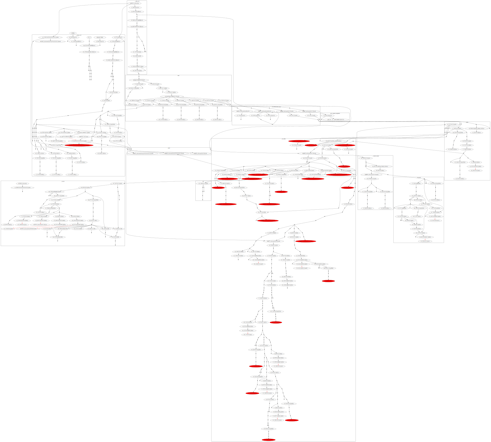
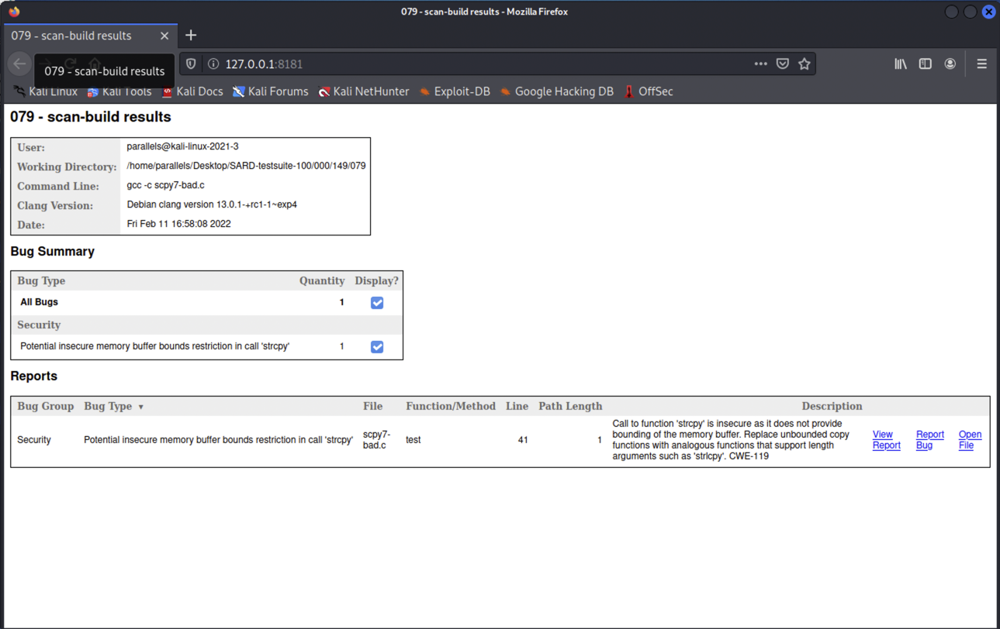
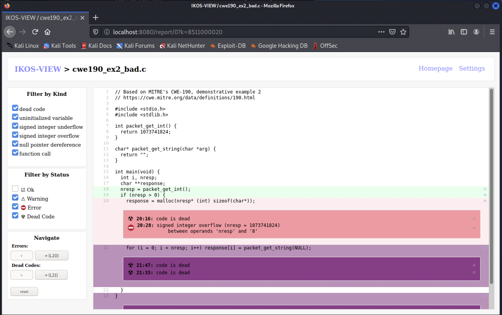
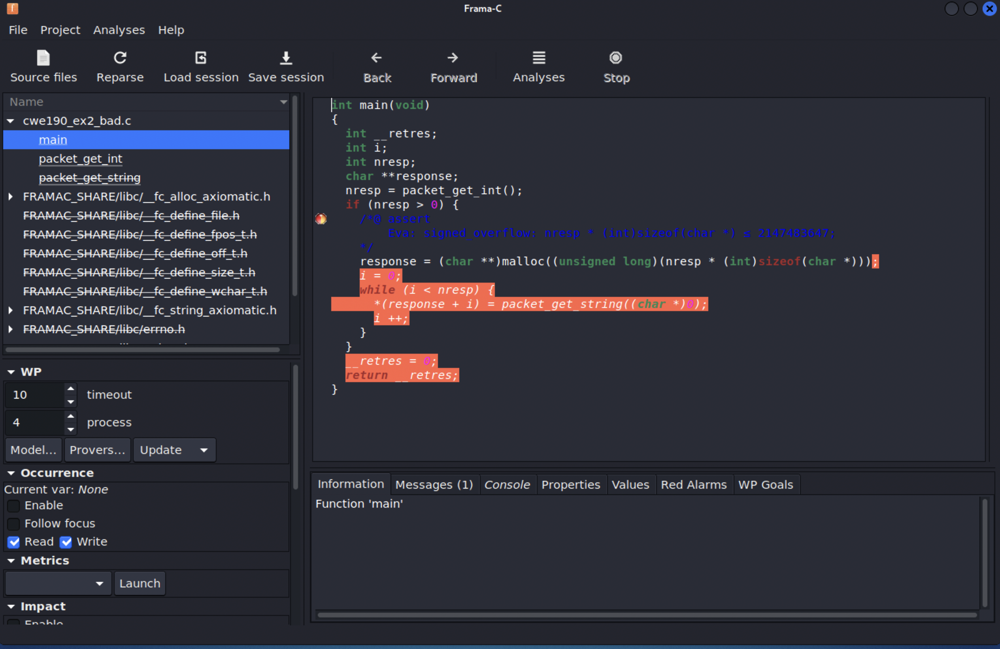
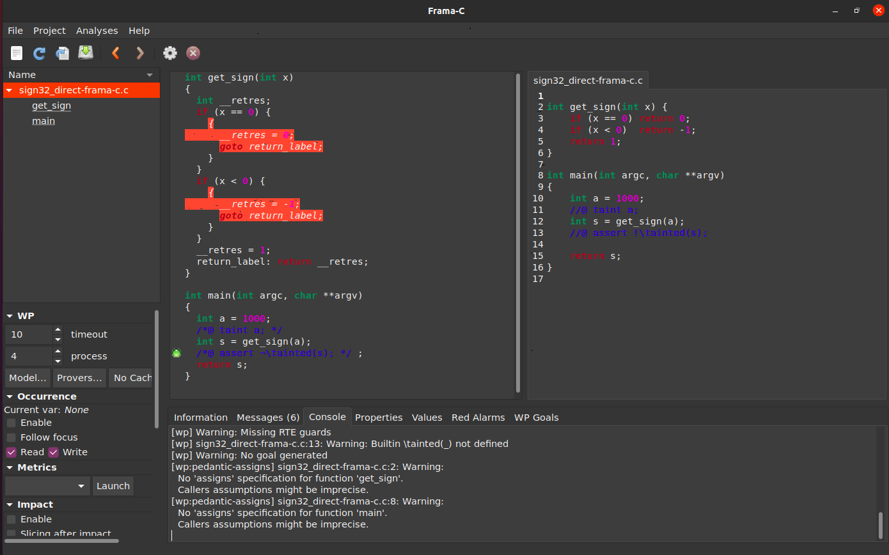
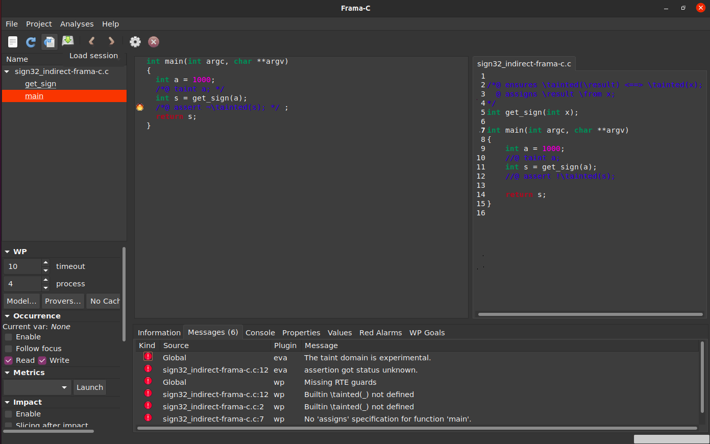
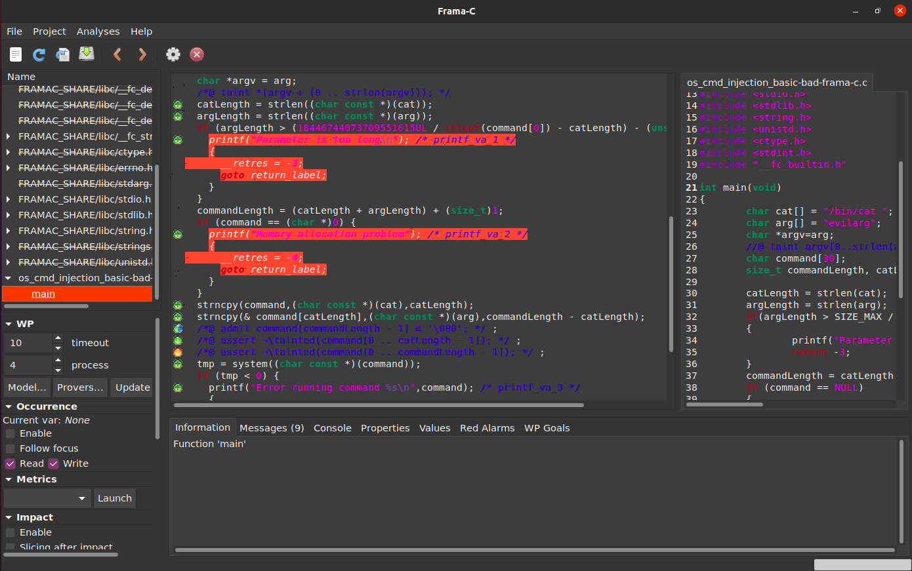
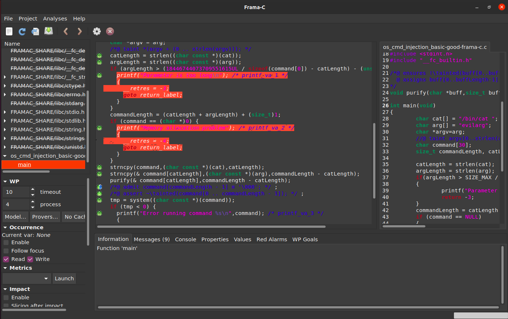

# Lab 1 - Low-level security

One of the most common sources of vulnerabilities, even to this day, remains related to exploits for low-level programming languages such as C or C++.
As languages that offer the programmers very fine-grained control, C and C++ are very insecure and error-prone, and one of the main sources of problems are related to memory management errors. For instance, many of the [2021 Top 25 CWEs](https://cwe.mitre.org/top25/archive/2021/2021_cwe_top25.html) are due to memory violations, type violations or undefined behavior in C or similar languages. To assist programmers in avoiding to develop code susceptible to many of these violations, secure C coding standards such [SEI CERT](https://wiki.sei.cmu.edu/confluence/display/seccode/SEI+CERT+Coding+Standards) have also been proposed.

Instead of focusing on exploitation and mitigation, we will study how various existing analysis tools can support developers in detecting and fixing vulnerabilities.

In this lab we will use a series of C examples that are part of the [SARD test suite 100/101 pair](https://samate.nist.gov/SRD/testsuite.php#sardsuites), from the larger [NIST SARD](https://samate.nist.gov/SARD/) project. Each example comes as a pair of C programs where the first (from test suite 100) has a flaw and the second (from test suite 101) demonstrates how to possibly fix the flaw.

## Lab install

To install the specific tools that will be used in this lab, run:
```
cd ses/vm
git pull
sh install-low.sh
```

## Topics & Additional References

Before we start, this lab will cover, by example, a series of program analysis techniques and tools. These topics are only introduced in the theoretical lectures in a broad sense and shortly introduced in this lab, which together should be sufficient for our experimentation. For a more in-depth contextualization or more technical detail, you may ask the instructors or check the following references:

* [Program Analysis for	Security](https://crypto.stanford.edu/cs155old/cs155-spring16/lectures/04-program-tools.pdf) from [Computer and Network Security @ Stanford](https://cs155.stanford.edu/)
* [Dynamic Analysis](http://www.cs.cmu.edu/~ckaestne/17313/2018/20181016-qa-dynamic.pdf) from [Foundations of Software Engineering @ CMU](https://cmu-313.github.io/)
* [Static Analysis](http://www.cs.cmu.edu/~ckaestne/17313/2018/20181018-qa-static.pdf) from [Foundations of Software Engineering @ CMU](https://cmu-313.github.io/)
* [Memory Safety](https://inst.eecs.berkeley.edu/~cs161/sp19/lectures/lec03_safety.pdf) from [Computer Security @ Berkeley](https://sp23.cs161.org/)
* [Taint analysis](https://www.cs.cmu.edu/~ckaestne/15313/2018/20181023-taint-analysis.pdf) from [Foundations of Software Engineering @ CMU](https://cmu-313.github.io/)
* [Side Channel Attacks](https://cseweb.ucsd.edu/classes/wi22/cse127-a/slides/7-sidechannels.pdf) from [ Intro to Computer Security @ UCSD](https://cseweb.ucsd.edu/classes/wi22/cse127-a/)
* [Constant-time Programming](https://cseweb.ucsd.edu/~dstefan/cse130-winter18/lectures/week10/) from [Programming Languages: Principles and Paradigms @ UCSD](https://cseweb.ucsd.edu/~dstefan/cse130-winter18/)

## [Dynamic Program Analysis](https://oaklandsok.github.io/papers/song2019.pdf)

Dynamic program analysis is typically used to denote analysis methods that examine an application as it’s running to find vulnerabilities that an attacker could exploit. They therefore focus on dynamically examining - at runtime - a single run of an application.

### [Valgrind](https://valgrind.org/)

Valgrind is an instrumentation framework for building dynamic analysis tools that works as an interpreter for compiled binaries, without the need to recompile the program or have access to the source code. Much like GDB, it can be used as a low-level debugger; since it instruments the original program at runtime, it may introduce a 20x-50x slowdown in program execution.

One of the most prominent Valgrind tools is the Memcheck memory error detector, which can find uses of freed or invalid memory, memory leaks, or uses of uninitialized memory. A detailed error list can be found in the [manual](https://valgrind.org/docs/manual/mc-manual.html#mc-manual.bugs).

#### Memory error - [buffer overflow](https://owasp.org/www-community/vulnerabilities/Buffer_Overflow)

Consider a simple [scpy7-bad.c](../c/SARD-testsuite-100/000/149/079/scpy7-bad.c) vulnerable C program found:

```C
#define	MAXSIZE		40
void
test(char *str)
{
	char *buf;

	buf = malloc(MAXSIZE);
	if(!buf)
		return;
	strcpy(buf, str);				/* FLAW */
	printf("result: %s\n", buf);
	free(buf);
}
```

This program allocates 40 bytes of heap memory for a buffer, to which it comes some input `str`. There is a likely heap buffer overflow vulnerability, if the size of `str` is larger than 40 (the size of `buf`), which may lead to an exploit.
If we compile and run this program with a slightly larger input, however:
```ShellSession
$ gcc scpy7-bad.c
$ ./a.out aaaaaaaaaaaaaaaaaaaaaaaaaaaaaaaaaaaaaaaaaa             
result: aaaaaaaaaaaaaaaaaaaaaaaaaaaaaaaaaaaaaaaa
```
the program does not crash although `strcpy` is writing past the buffer.

We can analyze the same program execution with `valgrind` and obtain indicative errors that `strcpy`is performing invalid writes:

<details>
<summary>Result</summary>

```ShellSession
$ valgrind ./a.out aaaaaaaaaaaaaaaaaaaaaaaaaaaaaaaaaaaaaaaaaa         
==57008== Memcheck, a memory error detector
==57008== Copyright (C) 2002-2017, and GNU GPL'd, by Julian Seward et al.
==57008== Using Valgrind-3.18.1 and LibVEX; rerun with -h for copyright info
==57008== Command: ./a.out aaaaaaaaaaaaaaaaaaaaaaaaaaaaaaaaaaaaaaaaaa
==57008==
==57008== Invalid write of size 1
==57008==    at 0x4855440: strcpy (vg_replace_strmem.c:553)
==57008==    by 0x108883: test (in /home/parallels/Desktop/SARD-testsuite-100/000/149/079/a.out)
==57008==    by 0x1088DB: main (in /home/parallels/Desktop/SARD-testsuite-100/000/149/079/a.out)
==57008==  Address 0x49ff068 is 0 bytes after a block of size 40 alloc'd
==57008==    at 0x484F0C8: malloc (vg_replace_malloc.c:381)
==57008==    by 0x108867: test (in /home/parallels/Desktop/SARD-testsuite-100/000/149/079/a.out)
==57008==    by 0x1088DB: main (in /home/parallels/Desktop/SARD-testsuite-100/000/149/079/a.out)
...
result: aaaaaaaaaaaaaaaaaaaaaaaaaaaaaaaaaaaaaaaaaa
==57008==
==57008== HEAP SUMMARY:
==57008==     in use at exit: 0 bytes in 0 blocks
==57008==   total heap usage: 2 allocs, 2 frees, 1,064 bytes allocated
==57008==
==57008== All heap blocks were freed -- no leaks are possible
==57008==
==57008== For lists of detected and suppressed errors, rerun with: -s
==57008== ERROR SUMMARY: 9 errors from 6 contexts (suppressed: 0 from 0)
```
</details>

#### [Memory leak](https://owasp.org/www-community/vulnerabilities/Memory_leak)

Consider a simple program [memory_leak_basic-bad.c](../c/SARD-testsuite-100/000/149/189/memory_leak_basic-bad.c).

```C
int main(int argc, char *argv[])
{
	double *buff = (double *)NULL;
	buff = malloc(10 * sizeof(double));
	if (buff == (double *)NULL)
	{
		printf ("Allocation Error: Cannot allocate buff.\n");
		exit(0);		
	}
	// do something
	buff = NULL;                                        /* FLAW */
	return 0;
}
```

This program has a memory leak, since the buffer `buff` is not freed after before the variable is reassigned.
Although this vulnerability does not affect the behavior of the program, it may clause a program to crash or run too slow due to excessive memory consumption. Valgrind will detect this leak:

<details>
<summary>Result</summary>

```ShellSession
$ valgrind ./a.out                                                     
==57431== Memcheck, a memory error detector
==57431== Copyright (C) 2002-2017, and GNU GPL'd, by Julian Seward et al.
==57431== Using Valgrind-3.18.1 and LibVEX; rerun with -h for copyright info
==57431== Command: ./a.out
==57431==
==57431==
==57431== HEAP SUMMARY:
==57431==     in use at exit: 80 bytes in 1 blocks
==57431==   total heap usage: 1 allocs, 0 frees, 80 bytes allocated
==57431==
==57431== LEAK SUMMARY:
==57431==    definitely lost: 80 bytes in 1 blocks
==57431==    indirectly lost: 0 bytes in 0 blocks
==57431==      possibly lost: 0 bytes in 0 blocks
==57431==    still reachable: 0 bytes in 0 blocks
==57431==         suppressed: 0 bytes in 0 blocks
==57431== Rerun with --leak-check=full to see details of leaked memory
==57431==
==57431== For lists of detected and suppressed errors, rerun with: -s
==57431== ERROR SUMMARY: 0 errors from 0 contexts (suppressed: 0 from 0)
```
</details>

#### [Use-after-free](https://owasp.org/www-community/vulnerabilities/Using_freed_memory)

Consider a simple program [useafterfree-bad.c](../c/SARD-testsuite-100/000/149/219/useafterfree-bad.c) that allocates some memory but uses the variable after being freed:

```C
int main(){
      char * x = (char *) malloc(4);
      if (x == NULL)
        {printf("Memory allocation problem"); return 1;}
      free(x);
      if(x) *x = 'a';									/* FLAW */
      return 0;
}
```
This vulnerability will often cause the program to crash, and, if the freed memory gets reused, an attacker may control `x` similarly to a buffer overflow attack.
Valgrind will also detect this error:

<details>
<summary>Result</summary>

```ShellSession
$ valgrind ./a.out                                                    
==57317== Memcheck, a memory error detector
==57317== Copyright (C) 2002-2017, and GNU GPL'd, by Julian Seward et al.
==57317== Using Valgrind-3.18.1 and LibVEX; rerun with -h for copyright info
==57317== Command: ./a.out
==57317==
==57317== Invalid write of size 1
==57317==    at 0x108864: main (in /home/parallels/Desktop/SARD-testsuite-100/000/149/219/a.out)
==57317==  Address 0x49ff040 is 0 bytes inside a block of size 4 free'd
==57317==    at 0x4851B40: free (vg_replace_malloc.c:872)
==57317==    by 0x10884F: main (in /home/parallels/Desktop/SARD-testsuite-100/000/149/219/a.out)
==57317==  Block was alloc'd at
==57317==    at 0x484F0C8: malloc (vg_replace_malloc.c:381)
==57317==    by 0x108823: main (in /home/parallels/Desktop/SARD-testsuite-100/000/149/219/a.out)
==57317==
==57317==
==57317== HEAP SUMMARY:
==57317==     in use at exit: 0 bytes in 0 blocks
==57317==   total heap usage: 1 allocs, 1 frees, 4 bytes allocated
==57317==
==57317== All heap blocks were freed -- no leaks are possible
==57317==
==57317== For lists of detected and suppressed errors, rerun with: -s
==57317== ERROR SUMMARY: 1 errors from 1 contexts (suppressed: 0 from 0)
```
</details>

### [Address Sanitizer](https://github.com/google/sanitizers/wiki/AddressSanitizer)

AddressSanitizer is another runtime memory error detector. It is developed by Google and works by instrumenting a LLVM program at compile-time, and is currently implemented in the Clang and GCC compilers. It therefore requires recompiling the program with the necessary flag. The runtime slowdown of the instrumented program is around 2x. In fact, there are multiple available [sanitizers](https://github.com/google/sanitizers) to catch different categories of errors (you may combine multiple analysis options):
* `-fsanitize=address` for memory errors;
* `-fsanitize=leak` for memory leaks;
* `-fsanitize=memory` for uses of undefined memory;
* `-fsanitize=undefined` for undefined behavior that is not in the C standard, see the [documentation](https://clang.llvm.org/docs/UndefinedBehaviorSanitizer.html#ubsan-checks) for more details.

####  [Buffer overflow](https://owasp.org/www-community/vulnerabilities/Buffer_Overflow)

Consider a simple program [scpy2-bad.c](../c/SARD-testsuite-100/000/149/077/scpy2-bad.c) with a stack buffer overflow vulnerability:

```C
#define	MAXSIZE		40
void
test(char *str)
{
	char buf[MAXSIZE];

	if(strlen(str) > MAXSIZE)
		return;
	strcpy(buf, str);				/* FLAW */
	printf("result: %s\n", buf);
}
```

When the input `str` is larger or equal than than `MAXSIZE`, the `strcpy` function will overflow the buffer `buf`, since the terminating '\0' character occupies and additional byte. The check however only tests for a larger `str`. If we compile our program with a recent Clang version with the address sanitizer on, it will detect an error for inputs of size `MAXSIZE`.

<details>
<summary>Result</summary>

```ShellSession
$ clang -fsanitize=address scpy2-bad.c  
 ./a.out aaaaaaaaaaaaaaaaaaaaaaaaaaaaaaaaaaaaaaaa                    
=================================================================
==57960==ERROR: AddressSanitizer: stack-buffer-overflow on address 0xffffcf13cf88 at pc 0x00000047f468 bp 0xffffcf13cf00 sp 0xffffcf13c6e8                
WRITE of size 41 at 0xffffcf13cf88 thread T0                                 
    #0 0x47f464 in strcpy (/home/parallels/Desktop/SARD-testsuite-100/000/149/077/a.out+0x47f464)
    #1 0x4c2b28 in test (/home/parallels/Desktop/SARD-testsuite-100/000/149/077/a.out+0x4c2b28)
    #2 0x4c2c2c in main (/home/parallels/Desktop/SARD-testsuite-100/000/149/077/a.out+0x4c2c2c)
    #3 0xffffb5c70ad0 in __libc_start_main csu/../csu/libc-start.c:332:16
    #4 0x4211b4 in _start (/home/parallels/Desktop/SARD-testsuite-100/000/149/077/a.out+0x4211b4)

Address 0xffffcf13cf88 is located in stack of thread T0 at offset 72 in frame
    #0 0x4c2a14 in test (/home/parallels/Desktop/SARD-testsuite-100/000/149/077/a.out+0x4c2a14)

  This frame has 1 object(s):
    [32, 72) 'buf' <== Memory access at offset 72 overflows this variable
HINT: this may be a false positive if your program uses some custom stack unwind mechanism, swapcontext or vfork
      (longjmp and C++ exceptions *are* supported)
SUMMARY: AddressSanitizer: stack-buffer-overflow (/home/parallels/Desktop/SARD-testsuite-100/000/149/077/a.out+0x47f464) in strcpy
Shadow bytes around the buggy address:
  0x200ff9e279a0: 00 00 00 00 00 00 00 00 00 00 00 00 00 00 00 00
  0x200ff9e279b0: 00 00 00 00 00 00 00 00 00 00 00 00 00 00 00 00
  0x200ff9e279c0: 00 00 00 00 00 00 00 00 00 00 00 00 00 00 00 00
  0x200ff9e279d0: 00 00 00 00 00 00 00 00 00 00 00 00 00 00 00 00
  0x200ff9e279e0: 00 00 00 00 00 00 00 00 f1 f1 f1 f1 00 00 00 00
=>0x200ff9e279f0: 00[f3]f3 f3 f3 f3 f3 f3 00 00 00 00 00 00 00 00
  0x200ff9e27a00: 00 00 00 00 00 00 00 00 00 00 00 00 00 00 00 00
  0x200ff9e27a10: 00 00 00 00 00 00 00 00 00 00 00 00 00 00 00 00
  0x200ff9e27a20: 00 00 00 00 00 00 00 00 00 00 00 00 00 00 00 00
  0x200ff9e27a30: 00 00 00 00 00 00 00 00 00 00 00 00 00 00 00 00
  0x200ff9e27a40: 00 00 00 00 00 00 00 00 00 00 00 00 00 00 00 00
Shadow byte legend (one shadow byte represents 8 application bytes):
  Addressable:           00
  Partially addressable: 01 02 03 04 05 06 07
  Heap left redzone:       fa
  Freed heap region:       fd
  Stack left redzone:      f1
  Stack mid redzone:       f2
  Stack right redzone:     f3
  Stack after return:      f5
  Stack use after scope:   f8
  Global redzone:          f9
  Global init order:       f6
  Poisoned by user:        f7
  Container overflow:      fc
  Array cookie:            ac
  Intra object redzone:    bb
  ASan internal:           fe
  Left alloca redzone:     ca
  Right alloca redzone:    cb
==57960==ABORTING
```
</details>

#### [Undefined behavior](https://owasp.org/www-community/vulnerabilities/Undefined_Behavior)

Consider the program [cwe190_ex2_bad.c](../c/misc/cwe190_ex2_bad.c) that contains a known vulnerable excerpt from OpenSSH 3.3, and reported in [CWE-190](https://cwe.mitre.org/data/definitions/190.html):

```C
#include <stdio.h>
#include <stdlib.h>

int packet_get_int() {
  return 1073741824;
}

char* packet_get_string(char *arg) {
  return "";
}

int main(void) {
  int i, nresp;
  char **response;
  nresp = packet_get_int();
  if (nresp > 0) {
    response = malloc(nresp* (int) sizeof(char*));
    for (i = 0; i < nresp; i++) response[i] = packet_get_string(NULL);
  }
}
```

If the result of function `packet_get_int` is a large signed integer such that its multiplication by `sizeof(char*)` (typically 4 or 8 for 32-bit or 64-bit architectures, respectively) does not fit into a signed integer, the signed integer multiplication will overflow, causing `malloc` to allocate 0 bytes and the following loop to crash the program.

Since signed integer overflows are undefined behavior in the C standard ([wiki](https://en.wikipedia.org/wiki/Integer_overflow)), we can compile with the `undefined` sanitizer to find this error at runtime:

<details>
<summary>Result</summary>

```ShellSession
$ clang -fsanitize=undefined cwe190_ex2_bad.c
$ ./a.out                                                              1 ⚙
test.c:17:28: runtime error: signed integer overflow: 1073741824 * 8 cannot be represented in type 'int'
SUMMARY: UndefinedBehaviorSanitizer: undefined-behavior test.c:17:28 in
UndefinedBehaviorSanitizer:DEADLYSIGNAL
==59588==ERROR: UndefinedBehaviorSanitizer: SEGV on unknown address 0x000032c3f000 (pc 0x000000422e40 bp 0xffffc4636690 sp 0xffffc4636630 T59588)         
==59588==The signal is caused by a WRITE memory access.                      
    #0 0x422e40 in main (/home/parallels/Desktop/SARD-testsuite-100/000/149/089/a.out+0x422e40)
    #1 0xffff8e260ad0 in __libc_start_main csu/../csu/libc-start.c:332:16
    #2 0x402ff4 in _start (/home/parallels/Desktop/SARD-testsuite-100/000/149/089/a.out+0x402ff4)

UndefinedBehaviorSanitizer can not provide additional info.
SUMMARY: UndefinedBehaviorSanitizer: SEGV (/home/parallels/Desktop/SARD-testsuite-100/000/149/089/a.out+0x422e40) in main
==59588==ABORTING
```
</details>

### [Taintgrind](https://github.com/wmkhoo/taintgrind)

The purpose of taint analysis, a powerful method for discovering security violations, is to track information flow from sources to sinks within a program.
It is typically used for checking an *integrity* property, by identifying dangerous flows from untrusted inputs (sources) into sensitive destinations (sinks); as we will see later, sources are often allowed to reach sinks as long as they pass through validators or sanitizers that enforce security constraints.

Taintgrind is a taint-tracking plugin for Valgrind.
As a binary instrumentation tool, Taintgrind allows marking specific bytes - typically user input data - as tainted and propagates taint at the byte level through memory operations.

Navigate to the [vm](../vm) folder and run `make run-taintgrind`.
It will launch a taintgrind-powered container :
```ShellSession
$ sudo docker run -v ${HOME}:${HOME} -it hugopacheco/taintgrind
taintgrind@container$
```

#### Direct flows

Consider for instance the program [os_cmd_injection_basic-bad.c](../c/SARD-testsuite-100/000/149/241/os_cmd_injection_basic-bad.c) that shows the content of a user-supplied file and contains a classical command injection [vulnerability](https://cwe.mitre.org/data/definitions/78.html): the user may append additional bash commands to the input, that will get executed. The most relevant snippet is the following:
```C
	strncpy(command, cat, catLength);
	strncpy(command + catLength, argv[1], commandLength - catLength);
	if (system(command) < 0) { ... }
```
The user-supplied string, stored in `argv[1]`, is appended to the string `command` that will be executed within a `system` call. The cause of this vulnerability is therefore that a critical operation (the system call) depends on user input.

We can use Taintgrind-specific flags to mark the first 8 bytes of `argv[1]` as tainted, and print the taint status of each block of 8 bytes in the `command` string. File [os_cmd_injection_basic-bad-taintgrind.c](../c/SARD-testsuite-100/000/149/241/os_cmd_injection_basic-bad-taintgrind.c) has the full instrumentation.
```C
TNT_TAINT(argv[1],8);
strncpy(command, cat, catLength);
strncpy(command + catLength, argv[1], commandLength - catLength);
unsigned int t;
for (int i=0; i < commandLength; ) {
  TNT_IS_TAINTED(t,command+i,8);
  printf("%08x ",t);
  i+=8;
}
if (system(command) < 0) { ... }
```

We can now compile the instrumented program and run it with Taintgrind. Note how the outcome of the analysis taints exactly 8 bytes of the input that are copied to the output bytes [^1].
<details>
<summary>Result</summary>

```ShellSession
taintgrind@container$ gcc -g -O0 os_cmd_injection_basic-bad-taintgrind.c
taintgrind@container$ taintgrind ./a.out aaaaaaaabbbb 2> log                                                                           
/usr/local/bin/valgrind --tool=taintgrind ./a.out aaaaaaaa
00000000 ffffff00 000000ff
```
</details>

Taintgrind also generates a detailed log that is being redirected to a file in this example. You may render that graph to a SVG image using Graphviz as follows:
<details>
<summary>Result</summary>

```ShellSession
taintgrind@container$ taintgrind-log2dot log > log.dot
taintgrind@container$ dot -Tsvg log.dot -o log.svg
```


</details>

[^1]: Note that each 8-byte block is printed in reverse order since `amd64` uses a little endian representation.

#### Indirect flows

Taintgrind only considers direct flows as information for propagating taint; indirect flows - e.g., when a memory adress depends on a variable used for calculating a conditional branch - are not captured by the analysis. We can confirm this with a sample program [sign-32-taintgrind.c](../c/misc/sign32-taintgrind.c) with an indirect flow in the following function:
```C
int get_sign(int x) {
    if (x == 0) return 0;
    if (x < 0)  return -1;
    return 1;
}
```
In this function, the value of the output depends on the value of the input variable `x`, however, `x` is not directly assigned/copied to the output. If we run Taintgrind on this example it will signal no taint as expected:

<details>
<summary>Result</summary>

```ShellSession
taintgrind@container$ gcc -g -O0 sign32-taintgrind.c                                                                        
taintgrind@container$ taintgrind ./a.out 2> log                                                                               
/usr/local/bin/valgrind --tool=taintgrind ./a.out
00000000
```
</details>

For more details on how Taintgrind operates check the [development](https://github.com/wmkhoo/taintgrind) page and this [presentation](https://github.com/h2hconference/2019/raw/master/H2HC%20-%20Marek%20Zmyslowski%20-%20Crash%20Analysis%20with%20Reverse%20Taint.pptx).

### [Clang Data Flow Sanitizer](https://clang.llvm.org/docs/DataFlowSanitizer.html)

DataFlowSanitizer is a taint-tracking plugin for Clang/LLVM.
Like Taintgrind, it uses a byte-level memory tracking to propagate taint through the execution of a C program; but unlike Taintgrind, it works by instrumenting the C program at compilation time. This requires that taint will only be precisely tracked for code that has been compiled with support for DataFlowSanitizer. If your program depends on external libraries, you will need to recompile these or pass additional information to DataFlowSanitizer (see the documentation).

#### Direct flows

Consider the [os_cmd_injection_basic-bad-dfsan.c](../c/SARD-testsuite-100/000/149/241/os_cmd_injection_basic-bad-dfsan.c), instrumented with DataFlowSanitizer taint trackers. Taint labels are unsigned integers, that can be applied to memory blocks. The relevant snippet is the following:
```C
dfsan_label argv1_label = 1;
dfsan_set_label(argv1_label,argv[1],8);
strncpy(command, cat, catLength);
strncpy(command + catLength, argv[1], commandLength - catLength);
dfsan_label command_label;
for (int i=0; i < commandLength; ) {
  command_label = dfsan_read_label(command+i,8);
  printf("%u ",command_label);
  i+=8;
}
if (system(command) < 0) { ... }
```

If we compile and run this program, we can see that two byte blocks of the output are tainted with label 1 (0 is the default non-tainted label).

```ShellSession
$ clang -fsanitize=dataflow os_cmd_injection_basic-bad-dfsan.c
$ ./a.out aaaaaaaa                        
/bin/cat: aaaaaaaa: No such file or directory
0 1 1
```

#### Indirect flows

Similarly to Taintgrind, DataFlowSanitizer only considers direct information flows by default.
Recall the [sign-32-dfsan.c](../c/misc/sign32-dfsan.c) example, with an indirect flow in the `get_sign` function, now instrumented with DataFlowSanitizer support.

If we compile and run this program, DataFlowSanitizer will not detect our indirect flow:
<details>
<summary>Result</summary>

```ShellSession
$ clang -fsanitize=dataflow sign32-dfsan.c
$ ./a.out                                                    
a.out: sign32.c:18: int main(int, char **): Assertion `dfsan_has_label(s_label, a_label)' failed.
zsh: abort      ./a.out
```
</details>

In the working version of Clang 15 (see the [documentation](https://releases.llvm.org/15.0.0/tools/clang/docs/DataFlowSanitizer.html)), there is however an experimental LLVM feature `-dfsan-conditional-callbacks` that adds conditional branch analysis support to DataFlowSanitizer. We can try a similar patch to LLVM that is pre-bundled in this [repository](https://github.com/mcopik/clang-dfsan) and described in this [post](https://mcopik.github.io/blog/2020/dataflow/).

Change into the [vm](../vm) folder and run `make run-dfsan`.
It will launch a shell inside a new docker container for the built docker image. Your home folder will be shared with the container.
```ShellSession
$ sudo docker run -v ${HOME}:${HOME} -it mcopik/clang-dfsan:cfsan-9.0
```

Inside the container, move into the `examplefolder` directory (change this) and compile it. You may then run the example. If the assertion raises no error, taint was tracked as expected.
```ShellSession
cfsan@container$ cd examplefolder
cfsan@container$ clang-cfsan sign32-dfsan.c
cfsan@container$ ./a.out
cfsan@container$ 
```

#### Other extensions

The Clang/LLVM Data Flow Sanitizer has been used as a core taint analysis engine for many other projects.
One such example is [PolyTracker](https://blog.trailofbits.com/2019/11/01/two-new-tools-that-tame-the-treachery-of-files/), which allows constructing a taint dependency graph (starting from taint inputs bytes) for the runtime execution of real-world programs such as PDF viewers.

### [TIMECOP](https://www.post-apocalyptic-crypto.org/timecop/)

#### Timing attacks

Imagine a naive login program that receives a password from a user and checks it is the same as a fixed *secret* stored password.
The core of such program could be a function:
```C
int check(char *arg, char *pass)
{
  int n = 5;
  int i;
  for (i=0; arg[i]==pass[i] && i < n; i++);
  return (i==n);
}
```
For simplicity, we are assuming that all passwords are 5 characters in length.
This code traverses both arrays until the predefined length, but stops as soon as a character is different among both arrays.

Although this code is perfectly correct in terms of behavior, it has a non-functional security vulnerability: the number of loop iterations depends on the value of the secretly stored password. Therefore, if an attacker gets to measure the amount of time that the program takes to execute for different inputs, he will be able to extract more information about the secret password. As it turns out, the security community knows for a fact that it is not difficult at all for an attackers that has physical access to the computer to precisely measure execution times and quickly find the secret password. Even worse, [remote timing attacks](https://snyk.io/blog/node-js-timing-attack-ccc-ctf/), e.g. to an authentication module of a web server, are also perfectly feasible.

Timing attacks belong to a larger class of side-channel attacks, which encompasses any attack that exploits additional architectural aspects of the system to leak additional information about security-sensitive data. There are naturally many types of side-channel attacks, including [timing attacks](https://medium.com/spidernitt/introduction-to-timing-attacks-4e1e8c84b32b), [energy consumption attacks](https://en.wikipedia.org/wiki/Power_analysis), or the more recently-found [cache-based speculative execution attacks](https://seedsecuritylabs.org/Labs_20.04/System/).
The main characteristic of this general class of attacks is that they are harder to replicate and mitigate, as they are likely to vary across computers and installations, and are not 100% accurate, often requiring careful statistical analysis.

#### Constant-time analysis

The prevailing technique for protecting against timing attacks in low-level C code, accepted both by [industry](https://github.com/veorq/cryptocoding) and [academia](https://hal.inria.fr/hal-03046757/file/BarbosaetalOakland21.pdf) in the context of highly critical cryptographic code, is to to follow constant-time coding guidelines. The idea is that a program is constant-time if its control flow (if conditions, loop conditions, gotos) and memory accesses do not depend on secret data[^2].

There are nowadays several [tools](https://neuromancer.sk/article/26) that can automatically verify if code follows the constant-time guidelines. TIMECOP is a Valgrind plugin to dynamically check if a program's execution is constant time.
In a way, TIMECOP operates dually to Taintgrind, by using taint analysis techniques to check a *confidentiality* property, i.e., trying to find violations in which sensitive sources leak to untrusted sinks (for the case of constant-time, time-measurable operations). 


For TIMECOP, all memory locations are considered public by default; the user can explicitly mark some memory locations, e.g., the password in our example as secret, using annotations as shown in [pass-loop-bad-timecop.c](../c/misc/pass-loop-bad-timecop.c):
```C
int check(char *arg, char *pass)
{
  poison(pass,5); // secret password of size 5 bytes
  int i;
  for (i=0; arg[i]==pass[i] && i < 5; i++);
  return (i==n);
}
```
If we compile and run this program, with valgrind, secret locations will be treated as if they were uninitialized memory, which is conveniently restricted in a similar way; we can see in this case that the conditional expression `arg[i]==pass[i]` in the loop depends on secret/uninitialized memory, triggering an error:
<details>
<summary>Result</summary>

```C
$ clang pass-loop-bad-timecop.c
$ valgrind ./a.out
==305424== Memcheck, a memory error detector
==305424== Copyright (C) 2002-2017, and GNU GPL'd, by Julian Seward et al.
==305424== Using Valgrind-3.18.1 and LibVEX; rerun with -h for copyright info
==305424== Command: ./a.out
==305424==
==305424== Conditional jump or move depends on uninitialised value(s)
==305424==    at 0x401213: check (in /home/parallels/Desktop/ses/c/misc/a.out)
==305424==    by 0x40129C: main (in /home/parallels/Desktop/ses/c/misc/a.out)
==305424==
==305424== Conditional jump or move depends on uninitialised value(s)
==305424==    at 0x401213: check (in /home/parallels/Desktop/ses/c/misc/a.out)
==305424==    by 0x4012B8: main (in /home/parallels/Desktop/ses/c/misc/a.out)
==305424==
==305424==
==305424== HEAP SUMMARY:
==305424==     in use at exit: 0 bytes in 0 blocks
==305424==   total heap usage: 0 allocs, 0 frees, 0 bytes allocated
==305424==
==305424== All heap blocks were freed -- no leaks are possible
==305424==
==305424== Use --track-origins=yes to see where uninitialised values come from
==305424== For lists of detected and suppressed errors, rerun with: -s
==305424== ERROR SUMMARY: 8 errors from 2 contexts (suppressed: 0 from 0)
```
</details>

How can we then make our program constant-time? The major change is that the number of iterations of the loop cannot depend on the secret password. We can achieve that if we, for instance, iterate through all elements of both arrays, and compute a boolean that is the conjunction of the equality of all pairs of elements. Program [pass-loop-good-timecop.c](../c/misc/pass-loop-good-timecop.c)
illustrates this change:
```C
int check(char *arg, char *pass)
{
  poison(pass,5); // secret password of size 5 bytes
  int i,res=1;
  for (i=0; i < 5; i++) {
    res &= arg[i] == pass[i];
  }
  return res;
}
```

TIMECOP will not find any constant-time violations this time:
<details>
<summary>Result</summary>

```ShellSession
$ clang pass-loop-good-timecop.c
$ valgrind ./a.out
==305849== Memcheck, a memory error detector
==305849== Copyright (C) 2002-2017, and GNU GPL'd, by Julian Seward et al.
==305849== Using Valgrind-3.18.1 and LibVEX; rerun with -h for copyright info
==305849== Command: ./a.out
==305849==
==305849==
==305849== HEAP SUMMARY:
==305849==     in use at exit: 0 bytes in 0 blocks
==305849==   total heap usage: 0 allocs, 0 frees, 0 bytes allocated
==305849==
==305849== All heap blocks were freed -- no leaks are possible
==305849==
==305849== For lists of detected and suppressed errors, rerun with: -s
==305849== ERROR SUMMARY: 0 errors from 0 contexts (suppressed: 0 from 0)
```
</details>

[^2]: This is a simplification, as some CPU instructions may also take variable-time. Current research is also focused on accurately modelling constant-time policies that are robust w.r.t. real-world processor optimizations such as speculative execution, e.g. [this paper](https://goto.ucsd.edu/~gleissen/papers/spectre-semantics.pdf) or [this LLVM extension](https://llvm.org/docs/SpeculativeLoadHardening.html).

## [Static Program Analysis](https://cacm.acm.org/magazines/2022/1/257444-static-analysis/fulltext)

Static program analysis is typically used to denote analysis methods that examine the code of a program to find flaws and weaknesses that may be exploited by an attacker. They therefore focus on statically examining - at compile-time - all the possible runs of an application.

### [Scan-build](https://clang-analyzer.llvm.org/scan-build.html)

The scan-build utility is a static analysis tool provided by LLVM for detecting programming errors in C/C++ programs.

Consider the [scpy7-bad.c](../c/SARD-testsuite-100/000/149/079/scpy7-bad.c) C program from before that has a buffer overflow vulnerability.
Running `scan-build` on this example will generate a report that signals the call to `strcpy` as unsafe with a contextualization of the associated CWE; you can also graphically visualize the report. Note that this happens for **any** usage of `strcpy', even if there is no actual vulnerability.

<details>
<summary>Result</summary>

```ShellSession
$ scan-build --show-description -enable-checker security gcc -c scpy7-bad.c
scan-build: Using '/usr/lib/llvm-13/bin/clang' for static analysis
scpy7-bad.c:41:2: warning: Call to function 'strcpy' is insecure as it does not provide bounding of the memory buffer. Replace unbounded copy functions with analogous functions that support length arguments such as 'strlcpy'. CWE-119 [security.insecureAPI.strcpy]
        strcpy(buf, str);                               /* FLAW */
        ^~~~~~
1 warning generated.
scan-build: Analysis run complete.
scan-build: 1 bug found.
scan-build: Run 'scan-view /tmp/scan-build-2022-02-11-165808-3759-1' to examine bug reports.
$ scan-view /tmp/scan-build-2022-02-11-165808-3759-1
```


</details>

### [IKOS](https://github.com/NASA-SW-VnV/ikos)

IKOS is a static analyzer for C/C++ based on the theory of [Abstract Interpretation](https://en.wikipedia.org/wiki/Abstract_interpretation).
Its analysis is performed on top of LLVM and allows proving the absence of runtime errors in resulting applications.
As a static analysis tool that covers all program executions (e.g. for any input), it is not as precise as a dynamic analysis that covers a single program execution (e.g., for a specific input). IKOS performs a sound over-approximation of the behavior of a program, meaning that analysis may fail to prove that a safe program is safe, but proven programs are always safe.

Navigate to the [vm](../vm) folder and run `make run-ikos`.
It will launch an IKOS-powered container :
```ShellSession
$ sudo docker run -v ${HOME}:${HOME} -p8080:8080 -it hugopacheco/ikos
ikos@container$
```

Consider the program [cwe190_ex2_bad.c](../c/misc/cwe190_ex2_bad.c) program from before. IKOS will statically detect the signed integer overflow in the `malloc` argument which makes our program unsafe:
<details>
<summary>Result</summary>

```ShellSession
ikos@container$ ikos cwe190_ex2_bad.c                                                
[*] Compiling cwe190_ex2_bad.c
[*] Running ikos preprocessor
[*] Running ikos analyzer
[*] Translating LLVM bitcode to AR
[*] Running liveness analysis
[*] Running widening hint analysis
[*] Running interprocedural value analysis
[*] Analyzing entry point 'main'
[*] Checking properties for entry point 'main'

# Time stats:
clang        : 0.274 sec
ikos-analyzer: 0.046 sec
ikos-pp      : 0.033 sec

# Summary:
Total number of checks                : 8
Total number of unreachable checks    : 4
Total number of safe checks           : 3
Total number of definite unsafe checks: 1
Total number of warnings              : 0

The program is definitely UNSAFE

# Results
cwe190_ex2_bad.c: In function 'main':
cwe190_ex2_bad.c:20:28: error: signed integer overflow (nresp = 1073741824)
    response = malloc(nresp* (int) sizeof(char*));
                           ^
cwe190_ex2_bad.c: In function 'main':
cwe190_ex2_bad.c:20:16: unreachable: code is dead
    response = malloc(nresp* (int) sizeof(char*));
               ^
cwe190_ex2_bad.c: In function 'main':
cwe190_ex2_bad.c:21:33: unreachable: code is dead
    for (i = 0; i < nresp; i++) response[i] = packet_get_string(NULL);
                                ^
cwe190_ex2_bad.c: In function 'main':
cwe190_ex2_bad.c:21:47: unreachable: code is dead
    for (i = 0; i < nresp; i++) response[i] = packet_get_string(NULL);
                                              ^
cwe190_ex2_bad.c: In function 'main':
cwe190_ex2_bad.c:23:1: unreachable: code is dead
```
</details>

You may notice that the `ikos` utility also generates a `output.db` file with a log of the performed analysis, in the folder where it was invoked. You can also graphically inspect this log with the `ikos-view` tool that will launch a web server on <http://localhost:8080> (visit this web page in your host VM):
```ShellSession
ikos@container$ ikos-view output.db
```
<details>
<summary>Result</summary>


</details>

We can also analyze a similar program [cwe190_ex2_ok.c](../c/misc/cwe190_ex2_ok.c) with a fixed value for `nresp` that does not overflow.
IKOS no longer reports the overflow, however, the program is still potentially unsafe, namely if `malloc` fails to allocate memory and returns a `NULL` pointer:

<details>
<summary>Result</summary>

```ShellSession
ikos@container$ ikos cwe190_ex2_ok.c                                               
[*] Compiling cwe190_ex2_ok.c
[*] Running ikos preprocessor
[*] Running ikos analyzer
[*] Translating LLVM bitcode to AR
[*] Running liveness analysis
[*] Running widening hint analysis
[*] Running interprocedural value analysis
[*] Analyzing entry point 'main'
[*] Checking properties for entry point 'main'

# Time stats:
clang        : 0.119 sec
ikos-analyzer: 0.016 sec
ikos-pp      : 0.011 sec

# Summary:
Total number of checks                : 18
Total number of unreachable checks    : 0
Total number of safe checks           : 17
Total number of definite unsafe checks: 0
Total number of warnings              : 1

The program is potentially UNSAFE

# Results
cwe190_ex2_ok.c: In function 'main':
cwe190_ex2_ok.c:24:46: warning: pointer '&response[(int64_t)i]' might be null
        for (i = 0; i < nresp; i++) response[i] = packet_get_string(NULL);

```
</details>

We can fix this uncertainty by making sure to check that the result of `malloc` is not `NULL`, as in [cwe190_ex2_ok.c](../c/misc/cwe190_ex2_ok2.c). IKOS now reports that our program is safe:

<details>
<summary>Result</summary>

```ShellSession
ikos@container$ ikos cwe190_ex2_ok2.c                                                
[*] Compiling cwe190_ex2_ok2.c
[*] Running ikos preprocessor
[*] Running ikos analyzer
[*] Translating LLVM bitcode to AR
[*] Running liveness analysis
[*] Running widening hint analysis
[*] Running interprocedural value analysis
[*] Analyzing entry point 'main'
[*] Checking properties for entry point 'main'

# Time stats:
clang        : 0.113 sec
ikos-analyzer: 0.012 sec
ikos-pp      : 0.009 sec

# Summary:
Total number of checks                : 20
Total number of unreachable checks    : 0
Total number of safe checks           : 20
Total number of definite unsafe checks: 0
Total number of warnings              : 0

The program is SAFE

# Results
No entries.
```
</details>

### [Frama-C](https://frama-c.com/)

Frama-C is a source code analysis platform that aims at conducting verification of industrial-size programs written in ISO C99 source code. Frama-C supports the formal verification approach of analyzing a C implementation with respect to a functional specification of the ISO C99 standard, and provides to its users with a collection of [plugins](https://frama-c.com/html/kernel-plugin.html) that perform static and dynamic analysis for safety and security critical software. As an industrial project, some of Frama-C's plugins are [open-sourced](https://git.frama-c.com/pub/frama-c), while others are proprietary.

Navigate to the [vm](../vm) folder and run `make run-framac`.
It will launch a Frama-C-powered container with X support :
```ShellSession
$ sudo docker run -v ${HOME}:${HOME} -it --rm --net=host --env="DISPLAY" -v $HOME/.Xauthority:/root/.Xauthority:ro hugopacheco/framac
framac@container$
```

Frama-C's Eva plugin has been developed to statically show the absence of runtime errors on whole programs. It will perform a value analysis that (over-)estimates the set of possible values for each variables.
Consider the program [cwe190_ex2_bad.c](../c/misc/cwe190_ex2_bad.c) program from before. The Frama-C Eva plugin will statically detect the signed integer overflow in the `malloc` argument:

<details>
<summary>Result</summary>

```ShellSession
framac@container$ frama-c -eva cwe190_ex2_bad.c                                        
[kernel] Parsing cwe190_ex2_bad.c (with preprocessing)
[eva] Analyzing a complete application starting at main
[eva] Computing initial state
[eva] Initial state computed
[eva:initial-state] Values of globals at initialization

[eva:alarm] cwe190_ex2_bad.c:20: Warning:
  signed overflow. assert nresp * (int)sizeof(char *) ≤ 2147483647;
[eva] done for function main
[eva] cwe190_ex2_bad.c:20:
  assertion 'Eva,signed_overflow' got final status invalid.
[eva] ====== VALUES COMPUTED ======
[eva:final-states] Values at end of function packet_get_int:
  __retres ∈ {1073741824}
[eva:final-states] Values at end of function main:
  NON TERMINATING FUNCTION
[eva:summary] ====== ANALYSIS SUMMARY ======
  ----------------------------------------------------------------------------
  2 functions analyzed (out of 3): 66% coverage.
  In these functions, 5 statements reached (out of 13): 38% coverage.
  ----------------------------------------------------------------------------
  No errors or warnings raised during the analysis.
  ----------------------------------------------------------------------------
  1 alarm generated by the analysis:
       1 integer overflow
  1 of them is a sure alarm (invalid status).
  ----------------------------------------------------------------------------
  No logical properties have been reached by the analysis.
  ----------------------------------------------------------------------------
```
</details>

Frama-C also offers a GUI that you may simply invoke as:
```ShellSession
framac@container$ frama-c-gui cwe190_ex2_bad.c  
```
You can graphically configure the analysis plugins in the `Analyses` menu, where all the command-line plugin options are also available.
For instance, we can replicate the above Eva analysis and see the errors as annotations in the code:
<details>
<summary>Result</summary>


</details>

We can also analyze a similar program [cwe190_ex2_ok.c](../c/misc/cwe190_ex2_ok.c) with a fixed value for `nresp` that does not overflow.
Eva no longer reports the overflow, however, we get a different out of bounds error:

<details>
<summary>Result</summary>

```ShellSession
framac@container$ frama-c -eva cwe190_ex2_ok.c                                       
[kernel] Parsing cwe190_ex2_ok.c (with preprocessing)
[eva] Analyzing a complete application starting at main
[eva] Computing initial state
[eva] Initial state computed
[eva:initial-state] Values of globals at initialization

[eva] cwe190_ex2_ok.c:20: allocating variable __malloc_main_l20
[eva:alarm] cwe190_ex2_ok.c:21: Warning:
  out of bounds write. assert \valid(response + i);
[eva] cwe190_ex2_ok.c:21: starting to merge loop iterations
[eva] done for function main
[eva] ====== VALUES COMPUTED ======
[eva:final-states] Values at end of function packet_get_int:
  __retres ∈ {123}
[eva:final-states] Values at end of function packet_get_string:
  __retres ∈ {{ "" }}
[eva:final-states] Values at end of function main:
  __fc_heap_status ∈ [--..--]
  i ∈ [123..2147483647]
  nresp ∈ {123}
  response ∈ {{ NULL ; &__malloc_main_l20[0] }}
  __retres ∈ {0}
  __malloc_main_l20[0..122] ∈ {{ "" }} or UNINITIALIZED
[eva:summary] ====== ANALYSIS SUMMARY ======
  ----------------------------------------------------------------------------
  3 functions analyzed (out of 3): 100% coverage.
  In these functions, 15 statements reached (out of 15): 100% coverage.
  ----------------------------------------------------------------------------
  No errors or warnings raised during the analysis.
  ----------------------------------------------------------------------------
  1 alarm generated by the analysis:
       1 invalid memory access
  ----------------------------------------------------------------------------
  No logical properties have been reached by the analysis.
  ----------------------------------------------------------------------------
```
</details>

This error occurs because Eva assumes by default that the `malloc` function may always fail, e.g. if there is insufficient available memory, To avoid this error, we can pass an additional `-eva-no-alloc-returns-null` flag to the analysis.

<details>
<summary>Result</summary>

```ShellSession
framac@container$ frama-c -eva -eva-no-alloc-returns-null cwe190_ex2_ok.c            
[kernel] Parsing cwe190_ex2_ok.c (with preprocessing)
[eva] Analyzing a complete application starting at main
[eva] Computing initial state
[eva] Initial state computed
[eva:initial-state] Values of globals at initialization

[eva] cwe190_ex2_ok.c:20: allocating variable __malloc_main_l20
[eva] cwe190_ex2_ok.c:21: starting to merge loop iterations
[eva] done for function main
[eva] ====== VALUES COMPUTED ======
[eva:final-states] Values at end of function packet_get_int:
  __retres ∈ {123}
[eva:final-states] Values at end of function packet_get_string:
  __retres ∈ {{ "" }}
[eva:final-states] Values at end of function main:
  __fc_heap_status ∈ [--..--]
  i ∈ [123..2147483647]
  nresp ∈ {123}
  response ∈ {{ &__malloc_main_l20[0] }}
  __retres ∈ {0}
  __malloc_main_l20[0..122] ∈ {{ "" }} or UNINITIALIZED
[eva:summary] ====== ANALYSIS SUMMARY ======
  ----------------------------------------------------------------------------
  3 functions analyzed (out of 3): 100% coverage.
  In these functions, 15 statements reached (out of 15): 100% coverage.
  ----------------------------------------------------------------------------
  No errors or warnings raised during the analysis.
  ----------------------------------------------------------------------------
  0 alarms generated by the analysis.
  ----------------------------------------------------------------------------
  No logical properties have been reached by the analysis.
  ----------------------------------------------------------------------------
```
</details>

This example is now analyzed with no errors and alarms, indicating that our program is safe.
The precision (in tradeoff with efficiency) of the Eva plugin is highly configurable. If you encounter issues when analysing other examples, you may check the Eva [documentation](https://frama-c.com/fc-plugins/eva.html) page for more information about the Eva analysis and its optional flags.

#### User-supplied proof annotations

It is important to stress that Frama-C is *not* particularly designed to be used as an automated static analysis framework that typically scans a code base for known vulnerabilities.
Since Frama-C needs to consider all possible program behaviours, it will often fail to automatically discard all proof obligations that it generates for a program, and user-supplied annotations or domain restrictions may be necessary to guide the verification engine; such a tradeoff between precision and automation is common to all static analysis methods.

In this lab we will not delve into the details of the different analyses that Frama-C supports, nor attempt to give a crash course on formal program verification.
Nonetheless, for demonstrative purposes, consider the CWE 190 example from before, but where the `packet_get_int` is left abstract and no longer returns a fixed number; this poses a challenge for verification as the number of iterations of the loop cannot be decided statically and inferring precise constraints for dynamically-allocated memory is often complicated. We illustrate two possible approaches:
* [cwe190_ex2_ok1-frama-c.c](../c/misc/cwe190_ex2_ok1-frama-c.c): a user can supply additional annotations (and assumptions) to guide the proof that a general program is safe for any input;
* [cwe190_ex2_ok2-frama-c.c](../c/misc/cwe190_ex2_ok2-frama-c.c): if the range of possible inputs is a computationally small enough set, we can instruct Frama-C's Eva analysis to exhaustively search all possible program paths.

You may run and test both examples with:
```bash
framac@container$ frama-c-gui -wp -eva -eva-no-alloc-returns-null c/misc/<examplename>.c
```
For more information on the concrete proof techniques you may consult the Frama-C [documentation](https://frama-c.com/html/documentation.html).
You can also have a look at more challenging Frama-C case studies in these repositories:
* [https://git.frama-c.com/pub/open-source-case-studies](https://git.frama-c.com/pub/open-source-case-studies)
* [https://git.frama-c.com/pub/sate-6/-/tree/master](https://git.frama-c.com/pub/sate-6/-/tree/master)

#### Taint analysis

The Frama-C Eva plugin also provides an experimental form of static taint analysis that performs a data-dependency analysis, possibly assisted by user annotations. The Eva analysis propagates taint by computing an over-approximation of the set of tainted locations at each program point. Programmers can then supply special `taint` clauses and contracts that encode typical taint sources and sinks and will to be verified along-side the standard program analysis.

##### Simple example

Consider the [sign32_direct-frama-c.c](../c/misc/sign32_direct-frama-c.c) program:
```C
int get_sign(int x) {
    if (x == 0) return 0;
    if (x < 0)  return -1;
    return 1;
}

int main(int argc, char **argv)
{
    int a = 1000;
    //@ taint a;
    int s = get_sign(a);
    //@ assert !\tainted(s);

    return s;
}
```
The first annotation marks the input variable `a` as a taint source; the second asks Frama-C if the variable `s` - computed from `a` - is **not** a tant sink. In general, Frama-C won't be able to prove that memory is not tainted, e.g., due to semantic over-approximations; Frama-C taint analysis is rather designed to reason about when some memory location is definitely not tainted.
If you can run this example using the Eva taint domain:
<details>
<summary>Result</summary>

```ShellSession
framac@container$ frama-c-gui -wp -eva -eva-domains taint c/misc/sign32_direct_frama-c.c
```

</details>

The result may be slightly surprising, but it highlights that Frama-C's taint analysis only considers direct information flows; the input is never directly assigned to the output of the function, and only indirectly the output by affecting the conditional clauses.

Although we can not reason about indirect flows, we can change the default tainting behavior of `get_sign` by explicitly specifying a taint contract.
Consider the [sign32_indirect-frama-c.c](../c/misc/sign32_indirect-frama-c.c) program:
```C
/*@ ensures \tainted(\result) <==> \tainted(x);
  @ assigns \result \from x;
*/
int get_sign(int x);

int main(int argc, char **argv)
{
    int a = 1000;
    //@ taint a;
    int s = get_sign(a);
    //@ assert !\tainted(s);

    return s;
}
```
This time, we specify that function `get_sign` produces a result that is as tainted as its input; note that it is important to leave the definition of `get_sign` abstract, or else our annotated post-condition and the default taint analysis for the body of the function could lead to logical inconsistencies.
You can run this example as before:
<details>
<summary>Result</summary>

```ShellSession
framac@container$ frama-c-gui -wp -eva -eva-domains taint c/misc/sign32_indirect_frama-c.c
```

</details>
The result is as expected: variable `s` is possibly tainted and the second assertion fails.

##### Command injection

Let's consider a simplified version [os_cmd_injection_basic-bad-frama-c.c](../c/SARD-testsuite-100/000/149/241/os_cmd_injection_basic-bad-frama-c.c) of the command injection example from before, where we construct a string that shows the content of an argument file with name passed as an argument. For asking Frama-C if our executed command is tainted by the input, the relevant snippet is the following:
```C
//@ taint argv[0..strlen(argv)];
...
strncpy(command, cat, catLength);
strncpy(command + catLength, argv, commandLength - catLength);
//@ assert !\tainted(command[0..catLength-1]);
//@ assert !\tainted(command[0..commandLength-1]);
```
We can run the program as follows:
<details>
<summary>Result</summary>

```ShellSession
framac@container$ frama-c-gui -wp -eva- eva-domains taint -eva-no-alloc-returns-null -eva-context-valid-pointers c/SARD-testsuite-100/000/149/241/os_cmd_injection_basic-bad-frama-c.c
```

</details>

Looking at the output, Frama-C has correctly separated the command's prefix from the command's argument. Thus, the first assertion is true, since we have not tainted the prefix, while the second assertion is false, since we have tainted the argument.

We can also analyze a good version [os_cmd_injection_basic-good-frama-c.c](../c/SARD-testsuite-101/000/149/242/os_cmd_injection_basic-good-frama-c.c) of the program that sanitizes the input with a function `purify`. For that purpose, we can write a contract saying that `purify` always returns an untainted array, irrespective of its inputs:
```C
//@ ensures !\tainted(buff[0..buffLength-1]);
void purify(char *buff,size_t buffLength);

//@ taint argv[0..strlen(argv)];
...
strncpy(command, cat, catLength);
strncpy(command + catLength, argv, commandLength - catLength);
//@ assert !\tainted(command[0..catLength-1]);
//@ assert !\tainted(command[0..commandLength-1]);
```
We can run the program as before:
<details>
<summary>Result</summary>

```ShellSession
framac@container$ frama-c-gui -wp -eva- eva-domains taint -eva-no-alloc-returns-null -eva-context-valid-pointers c/SARD-testsuite-101/000/149/242/os_cmd_injection_basic-good-frama-c.c
```

</details>

Given our assumptions, Frama-C is now able to prove that the executed `command` string is not tainted.

### [Smack](https://smackers.github.io/)

SMACK is a software model checker for C programs. Like many previous tools, it is built on top of LLVM.
It can be used to verify properties encoded as regular C-style assertions in its input programs, and it will try to find a counter-example that violates the given properties.
SMACK can also check for classical safety properties by automatically generating assertions; explore the option `--check` under `smack --help`.

To set up SMACK, change into the [vm](../vm) folder and run `make run-smack`. It will run the following Docker command that will automatically open a new prompt inside a SMACK-powered container with access to `$HOME` in your host VM:
```ShellSession
$ sudo docker run -v $HOME:$HOME -it smackers/smack
smack@container$
```

To make it feasible to statically explore all possible program paths, SMACK resorts to a bounded model checking technique that will explore all paths only up to a (typically small) maximum depth.

#### Integer overflow

Recall the integer overflow vulnerability from [cwe190_ex2_bad-smack.c](../c/misc/cwe190_ex2_bad-smack.c). We can easily test this example in SMACK by defining the function `packet_get_int` as returning a random integer value:
```C
int packet_get_int() {
  return __VERIFIER_nondet_int();
}
```
Inside the SMACK container, run the following command; SMACK will detect the integer overflow and indicate a value of `nresp` for which that happens.
<details>
<summary>Result</summary>

```ShellSession
smack@container$ smack --check=integer-overflow c/misc/cwe190_ex2_bad-smack.c
SMACK program verifier version 2.8.0
/usr/local/share/smack/lib/smack.c(1885,3):
/usr/local/share/smack/lib/smack.c(1890,1):
c/misc/cwe190_ex2_bad-smack.c(20,11): smack:entry:main = -8305, CALL packet_get_int
c/misc/cwe190_ex2_bad-smack.c(10,10): CALL __VERIFIER_nondet_int
/usr/local/share/smack/lib/smack.c(1463,11): smack:ext:__SMACK_nondet_int = 268435456, x = 268435456
/usr/local/share/smack/lib/smack.c(1464,23):
/usr/local/share/smack/lib/smack.c(1464,34):
/usr/local/share/smack/lib/smack.c(1464,39):
/usr/local/share/smack/lib/smack.c(0,0):
/usr/local/share/smack/lib/smack.c(1464,34):
/usr/local/share/smack/lib/smack.c(1464,3): CALL __VERIFIER_assume
/usr/local/share/smack/lib/smack.c(1606,29): __VERIFIER_assume:arg:x = 1
/usr/local/share/smack/lib/smack.c(45,3):
/usr/local/share/smack/lib/smack.c(46,1):
/usr/local/share/smack/lib/smack.c(1464,3): RETURN from __VERIFIER_assume
/usr/local/share/smack/lib/smack.c(1465,3):
c/misc/cwe190_ex2_bad-smack.c(10,10): RETURN from __VERIFIER_nondet_int, smack:ext:__VERIFIER_nondet_int = 268435456
c/misc/cwe190_ex2_bad-smack.c(10,3):
c/misc/cwe190_ex2_bad-smack.c(20,11): RETURN from packet_get_int, nresp = 268435456
c/misc/cwe190_ex2_bad-smack.c(21,13):
c/misc/cwe190_ex2_bad-smack.c(21,7):
/usr/local/share/smack/lib/smack.c(1606,29): __SMACK_check_overflow:arg:flag = 1
/usr/local/share/smack/lib/smack.c(1409,3):
SMACK found an error: integer overflow.
```
</details>

#### Loop unrolling

The main challenge for static program analysis are undoubtedly loops, and SMACK's bounded verification follows a very different approach from the previous tools.
In practice, SMACK will unroll loops - but only up to a bounded maximum number of iterations that the user can control - and try to find an invalid program execution for the unrolled program.

Consider the [memory_leak_loop-bad.c](../c/SARD-testsuite-100/000/149/181/memory_leak_loop-bad.c) program that contains a memory inside a loop with the following code:
```C
for (i = 0; i < 10; ++i) {
  buf = (size_t *)malloc(i * sizeof(size_t));
  if (buf) buf = NULL;                         /* FLAW */
}
```
This loop is executed exactly 10 times; in each iteration, a block of memory is allocated and, if successfully allocated, leaked.
Since we know that there will be a memory leak if the `malloc` suceeds, we can introduce an assertion in program [memory_leak_loop-bad-assert-smack.c](../c/SARD-testsuite-100/000/149/181/memory_leak_loop-bad-assert-smack.c) to check if that is ever true:
```C
for (i = 0; i < 10; ++i) {
  buf = (size_t *)malloc(i * sizeof(size_t));
  assert (buf != NULL);
  if (buf) buf = NULL;                         /* FLAW */
}
```

If we run this example with SMACK, it will detect an assertion violation as expected:
<details>
<summary>Result</summary>

```ShellSession
smack@container$ smack c/SARD-testsuite-100/000/149/181/memory_leak_loop-bad-assert-smack.c
SMACK program verifier version 2.8.0
/usr/local/share/smack/lib/smack.c(1885,3):
/usr/local/share/smack/lib/smack.c(1890,1):
c/SARD-testsuite-100/000/149/181/memory_leak_loop-bad-assert-smack.c(23,7): smack:entry:main = -1032, smack:arg:main:$i0 = 11, smack:arg:main:$p1 = 12, main:arg:argc = 11
c/SARD-testsuite-100/000/149/181/memory_leak_loop-bad-assert-smack.c(0,0):
c/SARD-testsuite-100/000/149/181/memory_leak_loop-bad-assert-smack.c(23,16):
c/SARD-testsuite-100/000/149/181/memory_leak_loop-bad-assert-smack.c(23,2):
c/SARD-testsuite-100/000/149/181/memory_leak_loop-bad-assert-smack.c(24,26):
c/SARD-testsuite-100/000/149/181/memory_leak_loop-bad-assert-smack.c(24,28):
c/SARD-testsuite-100/000/149/181/memory_leak_loop-bad-assert-smack.c(24,19): CALL malloc, RETURN from malloc
c/SARD-testsuite-100/000/149/181/memory_leak_loop-bad-assert-smack.c(24,9):
c/SARD-testsuite-100/000/149/181/memory_leak_loop-bad-assert-smack.c(25,3): CALL __VERIFIER_assert
/usr/local/share/smack/lib/smack.c(1606,29): __VERIFIER_assert:arg:x = 0
/usr/local/share/smack/lib/smack.c(52,3):
c/SARD-testsuite-100/000/149/181/memory_leak_loop-bad-assert-smack.c(25,3): RETURN from __VERIFIER_assert
SMACK found an error.
```
</details>

What if we use SMACK's builtin memory safety checker instead? We can run the original program [memory_leak_loop-bad-smack.c](../c/SARD-testsuite-100/000/149/181/memory_leak_loop-bad-smack.c) as follows:
<details>
<summmary>Result</summary>

```ShellSession
smack@container$ smack c/SARD-testsuite-100/000/149/181/memory_leak_loop-bad-smack.c  --check=memleak            
SMACK program verifier version 2.8.0
/usr/local/share/smack/lib/smack.c:1631:17: warning: cast to smaller integer type 'int' from 'void (*)(void *, void *)' [-Wpointer-to-int-cast]
  __SMACK_dummy((int)__SMACK_check_memory_safety);
                ^~~~~~~~~~~~~~~~~~~~~~~~~~~~~~~~
1 warning generated.
SMACK found no errors with unroll bound 1.
```
</details>

Looking at the output, SMACK detected no memory leaks, but we know that there is one in the code. Is this a tool limitation? If you look closely at the log, you will notice the message:

> SMACK found no errors with unroll bound 1.

This means that, by default, SMACK will unroll the loop once and keep the remainder of the loop (with one less iteration) as it is. Exposing only some iterations of the loop is generally sufficient for invalidating assertions that occur in the body of the loop, as we have seen before. Then why is the memory leak not found? The answer lies in the fact that SMACK only insert the memory leak checking assertion at the end of the program; since we know that our loop needs to get executed exactly 10 times before reaching the end of the program, it won't find the bug unless the loop is fully unrolled.

You can try re-running SMACK with a concrete `unroll` parameter greater than 10:
<details>
<summary>Result</summary>

```ShellSession
smack@container$ smack --check=memory-safety c/SARD-testsuite-100/000/149/181/memory_leak_loop-bad-smack.c --unroll=11
SMACK program verifier version 2.8.0
/usr/local/share/smack/lib/smack.c:1631:17: warning: cast to smaller integer type 'int' from 'void (*)(void *, void *)' [-Wpointer-to-int-cast]
  __SMACK_dummy((int)__SMACK_check_memory_safety);
                ^~~~~~~~~~~~~~~~~~~~~~~~~~~~~~~~
1 warning generated.
/usr/local/share/smack/lib/smack.c(1885,3):
/usr/local/share/smack/lib/smack.c(1888,3):
/usr/local/share/smack/lib/smack.c(1890,1):
c/SARD-testsuite-100/000/149/181/memory_leak_loop-bad-smack.c(23,7): smack:entry:main = -1032, smack:arg:main:$i0 = 71, smack:arg:main:$p1 = 73, main:arg:argc = 71
c/SARD-testsuite-100/000/149/181/memory_leak_loop-bad-smack.c(0,0):
c/SARD-testsuite-100/000/149/181/memory_leak_loop-bad-smack.c(23,16):
c/SARD-testsuite-100/000/149/181/memory_leak_loop-bad-smack.c(23,2):
c/SARD-testsuite-100/000/149/181/memory_leak_loop-bad-smack.c(24,26):
c/SARD-testsuite-100/000/149/181/memory_leak_loop-bad-smack.c(24,28):
c/SARD-testsuite-100/000/149/181/memory_leak_loop-bad-smack.c(24,19): CALL malloc, RETURN from malloc
c/SARD-testsuite-100/000/149/181/memory_leak_loop-bad-smack.c(24,9):
c/SARD-testsuite-100/000/149/181/memory_leak_loop-bad-smack.c(25,7):
c/SARD-testsuite-100/000/149/181/memory_leak_loop-bad-smack.c(27,3):
c/SARD-testsuite-100/000/149/181/memory_leak_loop-bad-smack.c(28,2):
c/SARD-testsuite-100/000/149/181/memory_leak_loop-bad-smack.c(23,22): i = 1
c/SARD-testsuite-100/000/149/181/memory_leak_loop-bad-smack.c(23,2):
c/SARD-testsuite-100/000/149/181/memory_leak_loop-bad-smack.c(0,0):
c/SARD-testsuite-100/000/149/181/memory_leak_loop-bad-smack.c(23,16):
c/SARD-testsuite-100/000/149/181/memory_leak_loop-bad-smack.c(23,2):
c/SARD-testsuite-100/000/149/181/memory_leak_loop-bad-smack.c(24,26):
c/SARD-testsuite-100/000/149/181/memory_leak_loop-bad-smack.c(24,28):
c/SARD-testsuite-100/000/149/181/memory_leak_loop-bad-smack.c(24,19): CALL malloc, RETURN from malloc
c/SARD-testsuite-100/000/149/181/memory_leak_loop-bad-smack.c(24,9):
c/SARD-testsuite-100/000/149/181/memory_leak_loop-bad-smack.c(25,7):
c/SARD-testsuite-100/000/149/181/memory_leak_loop-bad-smack.c(27,3):
c/SARD-testsuite-100/000/149/181/memory_leak_loop-bad-smack.c(28,2):
c/SARD-testsuite-100/000/149/181/memory_leak_loop-bad-smack.c(23,22): i = 2
c/SARD-testsuite-100/000/149/181/memory_leak_loop-bad-smack.c(23,2):
c/SARD-testsuite-100/000/149/181/memory_leak_loop-bad-smack.c(0,0):
c/SARD-testsuite-100/000/149/181/memory_leak_loop-bad-smack.c(23,16):
c/SARD-testsuite-100/000/149/181/memory_leak_loop-bad-smack.c(23,2):
c/SARD-testsuite-100/000/149/181/memory_leak_loop-bad-smack.c(24,26):
c/SARD-testsuite-100/000/149/181/memory_leak_loop-bad-smack.c(24,28):
c/SARD-testsuite-100/000/149/181/memory_leak_loop-bad-smack.c(24,19): CALL malloc, RETURN from malloc
c/SARD-testsuite-100/000/149/181/memory_leak_loop-bad-smack.c(24,9):
c/SARD-testsuite-100/000/149/181/memory_leak_loop-bad-smack.c(25,7):
c/SARD-testsuite-100/000/149/181/memory_leak_loop-bad-smack.c(27,3):
c/SARD-testsuite-100/000/149/181/memory_leak_loop-bad-smack.c(28,2):
c/SARD-testsuite-100/000/149/181/memory_leak_loop-bad-smack.c(23,22): i = 3
c/SARD-testsuite-100/000/149/181/memory_leak_loop-bad-smack.c(23,2):
c/SARD-testsuite-100/000/149/181/memory_leak_loop-bad-smack.c(0,0):
c/SARD-testsuite-100/000/149/181/memory_leak_loop-bad-smack.c(23,16):
c/SARD-testsuite-100/000/149/181/memory_leak_loop-bad-smack.c(23,2):
c/SARD-testsuite-100/000/149/181/memory_leak_loop-bad-smack.c(24,26):
c/SARD-testsuite-100/000/149/181/memory_leak_loop-bad-smack.c(24,28):
c/SARD-testsuite-100/000/149/181/memory_leak_loop-bad-smack.c(24,19): CALL malloc, RETURN from malloc
c/SARD-testsuite-100/000/149/181/memory_leak_loop-bad-smack.c(24,9):
c/SARD-testsuite-100/000/149/181/memory_leak_loop-bad-smack.c(25,7):
c/SARD-testsuite-100/000/149/181/memory_leak_loop-bad-smack.c(27,3):
c/SARD-testsuite-100/000/149/181/memory_leak_loop-bad-smack.c(28,2):
c/SARD-testsuite-100/000/149/181/memory_leak_loop-bad-smack.c(23,22): i = 4
c/SARD-testsuite-100/000/149/181/memory_leak_loop-bad-smack.c(23,2):
c/SARD-testsuite-100/000/149/181/memory_leak_loop-bad-smack.c(0,0):
c/SARD-testsuite-100/000/149/181/memory_leak_loop-bad-smack.c(23,16):
c/SARD-testsuite-100/000/149/181/memory_leak_loop-bad-smack.c(23,2):
c/SARD-testsuite-100/000/149/181/memory_leak_loop-bad-smack.c(24,26):
c/SARD-testsuite-100/000/149/181/memory_leak_loop-bad-smack.c(24,28):
c/SARD-testsuite-100/000/149/181/memory_leak_loop-bad-smack.c(24,19): CALL malloc, RETURN from malloc
c/SARD-testsuite-100/000/149/181/memory_leak_loop-bad-smack.c(24,9):
c/SARD-testsuite-100/000/149/181/memory_leak_loop-bad-smack.c(25,7):
c/SARD-testsuite-100/000/149/181/memory_leak_loop-bad-smack.c(27,3):
c/SARD-testsuite-100/000/149/181/memory_leak_loop-bad-smack.c(28,2):
c/SARD-testsuite-100/000/149/181/memory_leak_loop-bad-smack.c(23,22): i = 5
c/SARD-testsuite-100/000/149/181/memory_leak_loop-bad-smack.c(23,2):
c/SARD-testsuite-100/000/149/181/memory_leak_loop-bad-smack.c(0,0):
c/SARD-testsuite-100/000/149/181/memory_leak_loop-bad-smack.c(23,16):
c/SARD-testsuite-100/000/149/181/memory_leak_loop-bad-smack.c(23,2):
c/SARD-testsuite-100/000/149/181/memory_leak_loop-bad-smack.c(24,26):
c/SARD-testsuite-100/000/149/181/memory_leak_loop-bad-smack.c(24,28):
c/SARD-testsuite-100/000/149/181/memory_leak_loop-bad-smack.c(24,19): CALL malloc, RETURN from malloc
c/SARD-testsuite-100/000/149/181/memory_leak_loop-bad-smack.c(24,9):
c/SARD-testsuite-100/000/149/181/memory_leak_loop-bad-smack.c(25,7):
c/SARD-testsuite-100/000/149/181/memory_leak_loop-bad-smack.c(27,3):
c/SARD-testsuite-100/000/149/181/memory_leak_loop-bad-smack.c(28,2):
c/SARD-testsuite-100/000/149/181/memory_leak_loop-bad-smack.c(23,22): i = 6
c/SARD-testsuite-100/000/149/181/memory_leak_loop-bad-smack.c(23,2):
c/SARD-testsuite-100/000/149/181/memory_leak_loop-bad-smack.c(0,0):
c/SARD-testsuite-100/000/149/181/memory_leak_loop-bad-smack.c(23,16):
c/SARD-testsuite-100/000/149/181/memory_leak_loop-bad-smack.c(23,2):
c/SARD-testsuite-100/000/149/181/memory_leak_loop-bad-smack.c(24,26):
c/SARD-testsuite-100/000/149/181/memory_leak_loop-bad-smack.c(24,28):
c/SARD-testsuite-100/000/149/181/memory_leak_loop-bad-smack.c(24,19): CALL malloc, RETURN from malloc
c/SARD-testsuite-100/000/149/181/memory_leak_loop-bad-smack.c(24,9):
c/SARD-testsuite-100/000/149/181/memory_leak_loop-bad-smack.c(25,7):
c/SARD-testsuite-100/000/149/181/memory_leak_loop-bad-smack.c(27,3):
c/SARD-testsuite-100/000/149/181/memory_leak_loop-bad-smack.c(28,2):
c/SARD-testsuite-100/000/149/181/memory_leak_loop-bad-smack.c(23,22): i = 7
c/SARD-testsuite-100/000/149/181/memory_leak_loop-bad-smack.c(23,2):
c/SARD-testsuite-100/000/149/181/memory_leak_loop-bad-smack.c(0,0):
c/SARD-testsuite-100/000/149/181/memory_leak_loop-bad-smack.c(23,16):
c/SARD-testsuite-100/000/149/181/memory_leak_loop-bad-smack.c(23,2):
c/SARD-testsuite-100/000/149/181/memory_leak_loop-bad-smack.c(24,26):
c/SARD-testsuite-100/000/149/181/memory_leak_loop-bad-smack.c(24,28):
c/SARD-testsuite-100/000/149/181/memory_leak_loop-bad-smack.c(24,19): CALL malloc, RETURN from malloc
c/SARD-testsuite-100/000/149/181/memory_leak_loop-bad-smack.c(24,9):
c/SARD-testsuite-100/000/149/181/memory_leak_loop-bad-smack.c(25,7):
c/SARD-testsuite-100/000/149/181/memory_leak_loop-bad-smack.c(27,3):
c/SARD-testsuite-100/000/149/181/memory_leak_loop-bad-smack.c(28,2):
c/SARD-testsuite-100/000/149/181/memory_leak_loop-bad-smack.c(23,22): i = 8
c/SARD-testsuite-100/000/149/181/memory_leak_loop-bad-smack.c(23,2):
c/SARD-testsuite-100/000/149/181/memory_leak_loop-bad-smack.c(0,0):
c/SARD-testsuite-100/000/149/181/memory_leak_loop-bad-smack.c(23,16):
c/SARD-testsuite-100/000/149/181/memory_leak_loop-bad-smack.c(23,2):
c/SARD-testsuite-100/000/149/181/memory_leak_loop-bad-smack.c(24,26):
c/SARD-testsuite-100/000/149/181/memory_leak_loop-bad-smack.c(24,28):
c/SARD-testsuite-100/000/149/181/memory_leak_loop-bad-smack.c(24,19): CALL malloc, RETURN from malloc
c/SARD-testsuite-100/000/149/181/memory_leak_loop-bad-smack.c(24,9):
c/SARD-testsuite-100/000/149/181/memory_leak_loop-bad-smack.c(25,7):
c/SARD-testsuite-100/000/149/181/memory_leak_loop-bad-smack.c(27,3):
c/SARD-testsuite-100/000/149/181/memory_leak_loop-bad-smack.c(28,2):
c/SARD-testsuite-100/000/149/181/memory_leak_loop-bad-smack.c(23,22): i = 9
c/SARD-testsuite-100/000/149/181/memory_leak_loop-bad-smack.c(23,2):
c/SARD-testsuite-100/000/149/181/memory_leak_loop-bad-smack.c(0,0):
c/SARD-testsuite-100/000/149/181/memory_leak_loop-bad-smack.c(23,16):
c/SARD-testsuite-100/000/149/181/memory_leak_loop-bad-smack.c(23,2):
c/SARD-testsuite-100/000/149/181/memory_leak_loop-bad-smack.c(24,26):
c/SARD-testsuite-100/000/149/181/memory_leak_loop-bad-smack.c(24,28):
c/SARD-testsuite-100/000/149/181/memory_leak_loop-bad-smack.c(24,19): CALL malloc, RETURN from malloc
c/SARD-testsuite-100/000/149/181/memory_leak_loop-bad-smack.c(24,9):
c/SARD-testsuite-100/000/149/181/memory_leak_loop-bad-smack.c(25,7):
c/SARD-testsuite-100/000/149/181/memory_leak_loop-bad-smack.c(27,3):
c/SARD-testsuite-100/000/149/181/memory_leak_loop-bad-smack.c(28,2):
c/SARD-testsuite-100/000/149/181/memory_leak_loop-bad-smack.c(23,22): i = 10
c/SARD-testsuite-100/000/149/181/memory_leak_loop-bad-smack.c(23,2):
c/SARD-testsuite-100/000/149/181/memory_leak_loop-bad-smack.c(0,0):
c/SARD-testsuite-100/000/149/181/memory_leak_loop-bad-smack.c(23,16):
c/SARD-testsuite-100/000/149/181/memory_leak_loop-bad-smack.c(23,2):
c/SARD-testsuite-100/000/149/181/memory_leak_loop-bad-smack.c(30,2):
/usr/local/share/smack/lib/smack.c(1879,3):
SMACK found an error: memory leak.
```
</details>

Since, for this simple program, the number of iterations is actually known at compile time, we can alternatively just instruct SMACK to statically unroll the loop:
<details>
<summary>Result</summary>

```ShellSession
smack@container$ smack --check=memory-safety c/SARD-testsuite-100/000/149/181/memory_leak_loop-bad-smack.c --static-unroll
SMACK program verifier version 2.8.0
/usr/local/share/smack/lib/smack.c:1631:17: warning: cast to smaller integer type 'int' from 'void (*)(void *, void *)' [-Wpointer-to-int-cast]
  __SMACK_dummy((int)__SMACK_check_memory_safety);
                ^~~~~~~~~~~~~~~~~~~~~~~~~~~~~~~~
1 warning generated.
/usr/local/share/smack/lib/smack.c(1885,3):
/usr/local/share/smack/lib/smack.c(1888,3):
/usr/local/share/smack/lib/smack.c(1890,1):
c/SARD-testsuite-100/000/149/181/memory_leak_loop-bad-smack.c(23,2): smack:entry:main = -1032, smack:arg:main:$i0 = 38, smack:arg:main:$p1 = 39, main:arg:argc = 38
c/SARD-testsuite-100/000/149/181/memory_leak_loop-bad-smack.c(24,19): CALL malloc, RETURN from malloc
c/SARD-testsuite-100/000/149/181/memory_leak_loop-bad-smack.c(24,9):
c/SARD-testsuite-100/000/149/181/memory_leak_loop-bad-smack.c(25,7):
c/SARD-testsuite-100/000/149/181/memory_leak_loop-bad-smack.c(28,2):
c/SARD-testsuite-100/000/149/181/memory_leak_loop-bad-smack.c(24,19): CALL malloc, RETURN from malloc
c/SARD-testsuite-100/000/149/181/memory_leak_loop-bad-smack.c(24,9):
c/SARD-testsuite-100/000/149/181/memory_leak_loop-bad-smack.c(25,7):
c/SARD-testsuite-100/000/149/181/memory_leak_loop-bad-smack.c(27,3):
c/SARD-testsuite-100/000/149/181/memory_leak_loop-bad-smack.c(28,2):
c/SARD-testsuite-100/000/149/181/memory_leak_loop-bad-smack.c(24,19): CALL malloc, RETURN from malloc
c/SARD-testsuite-100/000/149/181/memory_leak_loop-bad-smack.c(24,9):
c/SARD-testsuite-100/000/149/181/memory_leak_loop-bad-smack.c(25,7):
c/SARD-testsuite-100/000/149/181/memory_leak_loop-bad-smack.c(27,3):
c/SARD-testsuite-100/000/149/181/memory_leak_loop-bad-smack.c(28,2):
c/SARD-testsuite-100/000/149/181/memory_leak_loop-bad-smack.c(24,19): CALL malloc, RETURN from malloc
c/SARD-testsuite-100/000/149/181/memory_leak_loop-bad-smack.c(24,9):
c/SARD-testsuite-100/000/149/181/memory_leak_loop-bad-smack.c(25,7):
c/SARD-testsuite-100/000/149/181/memory_leak_loop-bad-smack.c(27,3):
c/SARD-testsuite-100/000/149/181/memory_leak_loop-bad-smack.c(28,2):
c/SARD-testsuite-100/000/149/181/memory_leak_loop-bad-smack.c(24,19): CALL malloc, RETURN from malloc
c/SARD-testsuite-100/000/149/181/memory_leak_loop-bad-smack.c(24,9):
c/SARD-testsuite-100/000/149/181/memory_leak_loop-bad-smack.c(25,7):
c/SARD-testsuite-100/000/149/181/memory_leak_loop-bad-smack.c(27,3):
c/SARD-testsuite-100/000/149/181/memory_leak_loop-bad-smack.c(28,2):
c/SARD-testsuite-100/000/149/181/memory_leak_loop-bad-smack.c(24,19): CALL malloc, RETURN from malloc
c/SARD-testsuite-100/000/149/181/memory_leak_loop-bad-smack.c(24,9):
c/SARD-testsuite-100/000/149/181/memory_leak_loop-bad-smack.c(25,7):
c/SARD-testsuite-100/000/149/181/memory_leak_loop-bad-smack.c(27,3):
c/SARD-testsuite-100/000/149/181/memory_leak_loop-bad-smack.c(28,2):
c/SARD-testsuite-100/000/149/181/memory_leak_loop-bad-smack.c(24,19): CALL malloc, RETURN from malloc
c/SARD-testsuite-100/000/149/181/memory_leak_loop-bad-smack.c(24,9):
c/SARD-testsuite-100/000/149/181/memory_leak_loop-bad-smack.c(25,7):
c/SARD-testsuite-100/000/149/181/memory_leak_loop-bad-smack.c(27,3):
c/SARD-testsuite-100/000/149/181/memory_leak_loop-bad-smack.c(28,2):
c/SARD-testsuite-100/000/149/181/memory_leak_loop-bad-smack.c(24,19): CALL malloc, RETURN from malloc
c/SARD-testsuite-100/000/149/181/memory_leak_loop-bad-smack.c(24,9):
c/SARD-testsuite-100/000/149/181/memory_leak_loop-bad-smack.c(25,7):
c/SARD-testsuite-100/000/149/181/memory_leak_loop-bad-smack.c(27,3):
c/SARD-testsuite-100/000/149/181/memory_leak_loop-bad-smack.c(28,2):
c/SARD-testsuite-100/000/149/181/memory_leak_loop-bad-smack.c(24,19): CALL malloc, RETURN from malloc
c/SARD-testsuite-100/000/149/181/memory_leak_loop-bad-smack.c(24,9):
c/SARD-testsuite-100/000/149/181/memory_leak_loop-bad-smack.c(25,7):
c/SARD-testsuite-100/000/149/181/memory_leak_loop-bad-smack.c(27,3):
c/SARD-testsuite-100/000/149/181/memory_leak_loop-bad-smack.c(28,2):
c/SARD-testsuite-100/000/149/181/memory_leak_loop-bad-smack.c(24,19): CALL malloc, RETURN from malloc
c/SARD-testsuite-100/000/149/181/memory_leak_loop-bad-smack.c(24,9):
c/SARD-testsuite-100/000/149/181/memory_leak_loop-bad-smack.c(25,7):
c/SARD-testsuite-100/000/149/181/memory_leak_loop-bad-smack.c(27,3):
c/SARD-testsuite-100/000/149/181/memory_leak_loop-bad-smack.c(28,2):
c/SARD-testsuite-100/000/149/181/memory_leak_loop-bad-smack.c(30,2):
/usr/local/share/smack/lib/smack.c(1879,3):
SMACK found an error: memory leak.
```
</details>

### [ctverif](https://github.com/michael-emmi/ctverif)

There are also quite a few tools, mostly research prototypes, that can statically check if a C program follows the constant-time guidelines. One such tools is `ctverif`, which is developed on top of the SMACK verification framework.

Beyond being dynamic vs static tools, the analysis techniques of TIMECOP and ctverif are slightly different[^3]:
* TIMECOP performs a dynamic taint analysis from secret data to time-sensitive expressions. It requires the explicit declaration of secret input data, where all remaining data is considered public;
* ctverif performs a static information flow analysis to verify a so-called non-interference property stating that *for similar public data, but possibly different secret data, the valuations of time-sensitive expressions shall remain the same*. It requires the explicit declaration of public input data, where all remaining data is considered secret.

Navigate to the [vm](../vm) folder and run `make run-ctverif`.
It will launch a ctverif-powered container :
```ShellSession
$ sudo docker run -v ${HOME}:${HOME} -it hugopacheco/ctverif
ctverif@container$
```

#### Password checker

Recall the password checker example from before. We can annotate the [pass-loop-bad-ctverif.c](../c/misc/pass-loop-bad-ctverif.c) program for ctverif by marking the pointer values and the sizes of public inputs as public; the array contents will remain secret:
```C
int check(char *arg, char *pass)
{
  public_in(__SMACK_value(arg));     // pointer value is public
  public_in(__SMACK_value(pass));    // pointer value is public
  public_in(__SMACK_values(arg,5));  // size of array is public and =5
  public_in(__SMACK_values(pass,5)); // size of array is public and =5
  int n = 5;
  int i;
  for (i=0; arg[i]==pass[i] && i < n; i++);

  return (i==n);
}
```

Inside the Docker container, you may run this example as follows:
<details>
<summary>Result</summary>

```ShellSession
ctverif@container# ctverif c/misc/pass-loop-bad-ctverif.c --entry-points check --unroll=10
ctverif version 1.0.1
SMACK program verifier version 2.8.0
Warning: could not resolve constant/variable $load.i8
c/misc/pass-loop-bad-ctverif.c(15,40):
c/misc/pass-loop-bad-ctverif.c(9,13):
/usr/local/share/smack/lib/smack.c(1885,3):
c/misc/pass-loop-bad-ctverif.c(9,13):
c/misc/pass-loop-bad-ctverif.c(0,0):
c/misc/pass-loop-bad-ctverif.c(15,34):
c/misc/pass-loop-bad-ctverif.c(0,0):
c/misc/pass-loop-bad-ctverif.c(15,3):
c/misc/pass-loop-bad-ctverif.c(0,0):
c/misc/pass-loop-bad-ctverif.c(15,34):
c/misc/pass-loop-bad-ctverif.c(0,0):
c/misc/pass-loop-bad-ctverif.c(15,3):
c/misc/pass-loop-bad-ctverif.c(0,0):
c/misc/pass-loop-bad-ctverif.c(15,34):
c/misc/pass-loop-bad-ctverif.c(0,0):
c/misc/pass-loop-bad-ctverif.c(15,3):
c/misc/pass-loop-bad-ctverif.c(0,0):
c/misc/pass-loop-bad-ctverif.c(15,34):
c/misc/pass-loop-bad-ctverif.c(0,0):
c/misc/pass-loop-bad-ctverif.c(15,3):
c/misc/pass-loop-bad-ctverif.c(0,0):
c/misc/pass-loop-bad-ctverif.c(15,34):
c/misc/pass-loop-bad-ctverif.c(0,0):
c/misc/pass-loop-bad-ctverif.c(15,3):
c/misc/pass-loop-bad-ctverif.c(0,0):
c/misc/pass-loop-bad-ctverif.c(15,34):
c/misc/pass-loop-bad-ctverif.c(0,0):
c/misc/pass-loop-bad-ctverif.c(17,12):
SMACK found an error.
```
</details>

Even tough the message is not very informative, ctverif found an error as expected: our loop's conditional expression depends on secret values.

As before, we can turn our program into a constant-time one [pass-loop-good-ctverif.c](../c/misc/pass-good-bad-ctverif.c), by forcing the loop to always traverse all elements of both arrays.
We may run such second program in the same way:
<details>
<summary>Result</summary>

```ShellSession
ctverif@container# ctverif c/misc/pass-loop-good-ctverif.c --entry-points check --unroll=10
ctverif version 1.0.1
SMACK program verifier version 2.8.0
c/misc/pass-loop-good-ctverif.c:16:9: SMACK warning: overapproximating bitwise operation and (can lead to false alarms); try adding all the flag(s) in: { --integer-encoding=bit-vector }
Warning: could not resolve constant/variable $load.i8
SMACK found no errors with unroll bound 10.
```
</details>

This time, ctverif detects no constant-time violation. Note that, to guarantee that this result is sound and all potential violations are caught, it is important to set a large-enough loop unroll parameter.

[^3]: Verifying the non-interference property is more challenging in practice but also more precise: information may flow from secret data to particular expression without it affecting the valuations of those expressions. This difference in precision becomes more evident when the program is allowed to reveal some secret information, e.g., it is natural for a password checker to reveal the return value stating if the user-introduced password was correct; this detail is however not relevant for our example. If interested, check the ctverif [paper](https://www.usenix.org/system/files/conference/usenixsecurity16/sec16_paper_almeida.pdf) for more information.

### [infer](http://fbinfer.com/)

Facebook infer is a tool that implements various static analyses on top of clang, and can be seen as a more advanced variant of scan-build. For a complete list of all the supported analyses/checkers, see the [documentation](https://fbinfer.com/docs/all-issue-types).

Navigate to the [vm](../vm) folder and run `make run-infer`. It will launch an infer-powered container:

#### Memory errors

Remember the [cwe190_ex2_bad.c](../c/misc/cwe190_ex2_bad.c) example. Running it with the default checkers plus the buffer overrun checker, infer will find a few issues:
<details>
<summary>Result</summary>
	
```ShellSession
infer@container# infer run --bufferoverrun -- clang -c cwe190_ex2_bad.c 
Capturing in make/cc mode...
Found 1 source file to analyze in /home/home/ses/c/misc/infer-out
1/1 [############################################################] 100% 75.942ms

cwe190_ex2_bad.c:20: error: Inferbo Alloc Is Big
  Length: 8589934592.
  18.   nresp = packet_get_int();
  19.   if (nresp > 0) {
  20.     response = malloc(nresp* (int) sizeof(char*));
                     ^
  21.     for (i = 0; i < nresp; i++) response[i] = packet_get_string(NULL);
  22.   }

cwe190_ex2_bad.c:20: error: Integer Overflow L1
  (1073741824 x 8):signed32.
  18.   nresp = packet_get_int();
  19.   if (nresp > 0) {
  20.     response = malloc(nresp* (int) sizeof(char*));
                     ^
  21.     for (i = 0; i < nresp; i++) response[i] = packet_get_string(NULL);
  22.   }

cwe190_ex2_bad.c:21: error: Null Dereference
  pointer `response` last assigned on line 20 could be null and is dereferenced at line 21, column 33.
  19.   if (nresp > 0) {
  20.     response = malloc(nresp* (int) sizeof(char*));
  21.     for (i = 0; i < nresp; i++) response[i] = packet_get_string(NULL);
                                      ^
  22.   }
  23. }


Found 3 issues
                  Issue Type(ISSUED_TYPE_ID): #
          Null Dereference(NULL_DEREFERENCE): 1
    Integer Overflow L1(INTEGER_OVERFLOW_L1): 1
  Inferbo Alloc Is Big(INFERBO_ALLOC_IS_BIG): 1
```
</details>

#### Taint analysis

Among its various analyses, infer also features a static taint analysis of C source code, named [quandary](https://fbinfer.com/docs/checker-quandary). In particular, it will perform a coarse-grained analysis at the level of program variables, in the sense that, unlike Frama-C, it does not attempt to model in full detail the C memory model and only considers direct flows.

Consider the  command injection example from before, adapted in [os_cmd_injection_basic-bad-infer.c](../c/SARD-testsuite-100/000/149/241/os_cmd_injection_basic-bad-infer.c). To use infer for taint analysis, we can configure taint sources and taint sinks, as shown in auxiliary file [.inferconfig](../c/SARD-testsuite-100/000/149/241/.inferconfig): we are defining that a special function `taint` marks its first argument as tainted; by default, infer will mark a few critical functions as taint sinks.
We can run this example as shown below:
<details>
<summary>Result</summary>

```ShellSession
infer@container# infer --quandary-only -g -- clang -c os_cmd_injection_basic-bad-infer.c 
Logs in /home/kali/Desktop/ses/c/SARD-testsuite-100/000/149/241/infer-out/logs
Capturing in make/cc mode...
Found 1 source file to analyze in /home/kali/Desktop/ses/c/SARD-testsuite-100/000/149/241/infer-out
2/2 [#########################################################] 100% 42.6ms

os_cmd_injection_basic-bad-infer.c:52: error: Shell Injection
  Other(taint()) at line 23, column 2 ~> ShellExec(system()) at line 52, column 6.                                                                        
  51. 
  52.   if (system(command) < 0)                                            /* FLAW */
           ^
  53.   {
  54.           printf("Error running command %s\n", command);


Found 1 issue
        Issue Type(ISSUED_TYPE_ID): #
  Shell Injection(SHELL_INJECTION): 1
```

Note that we adapted the source code to taint the `argv` parameter to function `main`. The error message illustrates that the function `system` is indeed considered a taint sink. You may also note that we needed to perform a minimal adaptation of the source code, by replacing `command + catLength` for the equivalent `command[catLength]` during the construction of the `command` array passed to `system`; this is likely because infer is considering `command + catLength` as new memory, and exemplifies how the subtle C memory model may not be fully captured.
</details>

Moreover, infer supports the configuration of taint sanitizers, that remove taint from its arguments and return untainted data.
Consider the adapted good version of our command injection example in [os_cmd_injection_basic-bad-infer.c](../c/SARD-testsuite-101/000/149/242/os_cmd_injection_basic-good-infer.c), with configuration file [.inferconfig](../c/SARD-testsuite-101/000/149/242/.inferconfig):
<details>
<summary>Result</summary>

```ShellSession
infer@container# infer --quandary-only -g -- clang -c os_cmd_injection_basic-good-infer.c 
Logs in /home/kali/Desktop/ses/c/SARD-testsuite-101/000/149/242/infer-out/logs
Capturing in make/cc mode...
Found 1 source file to analyze in /home/kali/Desktop/ses/c/SARD-testsuite-101/000/149/242/infer-out
3/3 [#########################################################] 100% 66.2ms

  No issues found
```

This time, infer will report no taint error. You may note that the C implementation of `purify` changes the argument array in-place and returns void. To make it suitable for infer, we had to make it return the untainted array, even though it is indeed the same memory, as infer only considers the output variables of sanitizers as untainted.
</details>

### [Security vulnerability scanners](https://www.nist.gov/itl/ssd/software-quality-group/source-code-security-analyzers)

There are several security vulnerability scanners that can automatically analyse a codebase for known vulnerabilities.
The main advantage of these tools is that they tend to support various programming languages, require low setup and can be typically integrated into the software development process using continuous integration to periodically check for vulnerabilities.

Although many of these scanners are full-fledged commercial solutions, we list a few that have free-to-use versions. The easiest way to try these tools is to set up a public repository and scan it online. For convenience, you may check the pre-computed analysis results for this repository:
* [Flawfinder](https://dwheeler.com/flawfinder/): for C/C++; needs to be run locally for your project;
* [Coverity](https://scan.coverity.com/): requires login to view results, you need to set it up for your repository;
* [GitHub Code Scanning](https://github.com/hpacheco/ses/security/code-scanning): public web interface for [CodeQL](https://codeql.github.com/) that offers automated code scanning for security vulnerabilities; formerly known as [LGTM](https://lgtm.com);
* [GitLab](https://docs.gitlab.com/ee/user/application_security/secure_your_application.html): integrated static analysis of source code;
* [SonarCloud](https://sonarcloud.io/summary/overall?id=hpacheco_ses): public web interface for [SonarQube](https://www.sonarqube.org/) analysis results;
* [Snyk Code Checker](https://snyk.io/code-checker/), a free version of the commercial [Snyk Code](https://snyk.io/product/snyk-code/);
* [SemGrep](https://semgrep.dev/), a lightweight rule-based static analyser.

## Tasks

The goal of this lab is to experiment with the dynamic and static analysis tools described above. We will detect and fix the vulnerabilities found in example C programs from the [c/SARD-testsuite-100](../c/SARD-testsuite-100) testsuite. 
1. Study and try out the tools described above.
2. Choose two vulnerable programs **under different categories** from [c/SARD-testsuite-100](../c/SARD-testsuite-100) to analyse. It is not mandatory to choose examples from this dataset; you may also choose examples of vulnerable C programs from other resources such as, e.g., another [SARD dataset](https://samate.nist.gov/SARD/testsuite.php) (one of the most commonly used is the [Juliet synthetic CWE dataset](https://samate.nist.gov/SARD/test-suites/112)) or a [real-world CVE dataset of memory vulnerabilities](https://vulnreproduction.github.io/). You may also explore a [real-world CVE dataset of timing side-channels](https://figshare.com/articles/dataset/Dataset_for_Empirical_Analysis_of_Software_Vulnerabilities_Causing_Timing_Side_Channels_/22725845). A collection of more comprehensive real-world datasets of vulnerable C code can be found in this [paper](https://arxiv.org/pdf/2304.00409.pdf).
3. For each chosen vulnerable program `c/SARD-testsuite-100/000/149/i`, find and study the equivalent but more secure program `c/SARD-testsuite-101/000/149/i+1`. If you chose a different dataset, propose a secure version of the vulnerable program.
4. Based on the above experiments, select a reasonable set of tools for analysing your program.
5. **In your group's GitHub repository, write a small report in the markdown file `Lab1.md`.**
6. Write a small report discussing, in general, what was your experience from the perspective of a software developer analysing the security of your code. **Please note that your grade will be decided by the quality of your report**: you are **not** required to experiment with all the tools **nor** acquire advanced understanding of the more technical details of the analysis behind each tool; nonetheless, you are **expected** to justify your tool selection and to interpret the tool results obtained with each selected tool. You shall answer these questions in particular:
   * which [CWE](https://cwe.mitre.org/)s are associated with each vulnerability?
   * was your vulnerability found by the automated scanners? From the error log (or lack thereof), what can you deduct about the scanner's analysis technique?
   * which tools have you found more suitable for analysing your vulnerabilities and why?
   * how have the chosen tools helped in finding those vulnerabilities?
   * which tool limitations did you encounter and which adjustments to the program or tool parameters have you found necessary?
   
   


