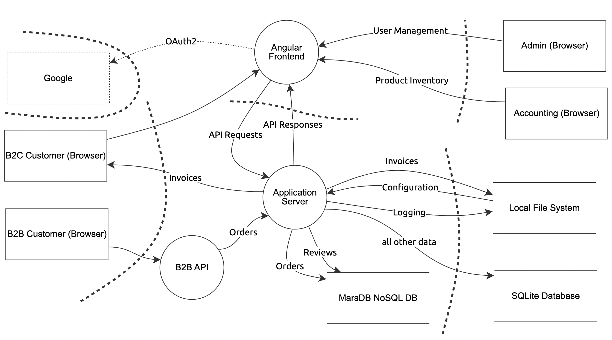

# Lab 3 - Web security

In this lab we will be focusing on analysing the security of web applications.
Web applications are extremely vulnerable in the sense that they mix a multitude of technologies and libraries and feature highly dynamic pages and content that are often difficult to enclose and characterise.

Instead of focusing on exploitation, we will study how various existing analysis tools can help developers in detecting and fixing web vulnerabilities:
* SAST: As for low-level C programs, various vulnerability scanners such as [SonarCloud](https://sonarcloud.io/) and [LGTM](https://lgtm.com/) also have good support for analysis the source code of web applications written in various languages (HTTP/PHP/JS/TS/Java/etc).
* DAST: In particular for web applications, vulnerability assessment tools such as [BurpSuite Community Edition](https://portswigger.net/burp/communitydownload) and [OWASP Zed Attack Proxy](https://owasp.org/www-project-zap/) can be used to navigate web sites, analyse HTTP requests/responses and perform automatic dynamic scans for vulnerabilities.

There exists a myriad of vulnerable web applications, e.g. from the [OWASP Vulnerable Web Applications Directory (VWAD)](https://owasp.org/www-project-vulnerable-web-applications-directory/), that have been developed for demonstrating common web vulnerabilities and how to exploit them.
One of the most modern and complete among such pedagogical web applications is the [OWASP Juice Shop](https://owasp.org/www-project-juice-shop/). 

Another good resource with detailed information about each type of vulnerability, including how to manually test if your application is vulnerable, is the [OWASP Web Security Testing Guide](https://owasp.org/www-project-web-security-testing-guide/v41/).

## Setting up the [OWASP Juice Shop](https://owasp.org/www-project-juice-shop/)

In this lab we will be looking into solving a few Juice Shop challenges. You will find a lot of information in the Juice Shop [companion guide](https://pwning.owasp-juice.shop/). 
Solving a challenge requires a basic understanding of an exploitation technique and crafting careful payloads that can get the attack done. In such a setting, reading previous [solutions](https://github.com/juice-shop/juice-shop/blob/master/SOLUTIONS.md) or looking at the project's [source code](https://github.com/juice-shop/juice-shop) is considered sort of cheating. For this lab, the focus is on analysing the vulnerabilities; we encourage you to search the many available additional resources for solving the challenges as you see fit (while trying not to take all the fun out of it).

Interesting for us, many Juice Shop challenges also feature:
* a [mitigation link](https://owasp.org/www-project-juice-shop/) with pointers to the [OWASP cheat sheet](https://cheatsheetseries.owasp.org/) related to the vulnerability;
* a [coding challenge](https://pwning.owasp-juice.shop/part1/challenges.html) that will open a dialog containing the actual code snippet responsible for the security vulnerability behind the challenge and ask the challenger to understand the code and suggest the best fix.

There are various options to deploy an instance of Juice Shop, all listed in the GitHub [page](https://github.com/juice-shop).
For a quick start, you may [deploy on Heroku](https://github.com/juice-shop/juice-shop#deploy-on-heroku-free-0month-dyno) or create a [Docker container](https://github.com/juice-shop/juice-shop#docker-container). However, for some tasks (and maximum vulnerability!) you will need to install [from sources](https://github.com/juice-shop/juice-shop#from-sources).

Inside the [vm](../vm) folder, you may just type:
* `make run-docker-juiceshop` to build and run from a Docker container. An instance of Juice Shop will be readily listening at `http://localhost:3000`.
* `make build-juiceshop` to build from sources.
* `make run-juiceshop` to run from built sources. An instance of Juice Shop will be readily listening at `http://localhost:3000`.

## Setting up [OWASP Mutillidae II](https://github.com/webpwnized/mutillidae) (Extra)

**For this lab, we will only consider Juice Shop exercises.** Nevertheless, for students interested in a more extensive list of web vulnerabilities or learning more about a particular vulnerability, OWASP Mutillidae II is a good source. It is a vulnerable web site that contains a categorised listing of OWASP vulnerabilities and a series of example vulnerable pages per category. You may also easily find additional information such as tutorials. For simple demonstrations of various vulnerabilities, you may also check [Google firing range](https://public-firing-range.appspot.com/).

<details>
<summary>More details</summary>

To install Mutillidae II, cd into the [vm](../vm) folder and run the following commands:
```ShellSession
git pull
sh install-mutillidae.sh
make start-mutillidae
```
You can try it out at <http://localhost/mutillidae/>.
In the first run, you will need to setup the DB; check [this link](https://miloserdov.org/?p=87) for further information.
You may also need to set a root mysql password; check [this link](https://miloserdov.org/?p=5873).

*Another important difference is that Juice Shop relies intensively on JavaScript for both client and server code, while Mutillidae II is mostly implemented in PHP.
Note that, in general, most security analysis tools and techniques perform better on static PHP code when compared to dynamic JavaScript content, due to its more predictable static structure.
Therefore, it may prove slightly more challenging for the tools (and ourselves) to identify some vulnerabilities in Juice Shop when compared to similar vulnerabilities in Mutillidae II.*
</details>

## Threat Modelling

In the theoretical classes you have already studied the importance of [threat modelling](https://owasp.org/www-community/Threat_Modeling) for understanding the security of a system.

<details>
<summary>More details</summary>

The Juice Shop developers have defined a general threat model [here](https://github.com/juice-shop/juice-shop/blob/master/threat-model.json), that provides an overview of the Juice Shop architecture, depicted below.

 

The model was created with the [OWASP Threat Dragon](https://owasp.org/www-project-threat-dragon/) tool. You may load the JSON file into the [online tool](https://www.threatdragon.com/) to visualize or edit the model.

</details>

## Dependency scanning

In a real software development life cycle, scanning for vulnerabilities within external libraries is a natural starting point. THis is not only useful information while choosing the right dependencies for your project, but also important during the development and testing of your applications. It wouldn't be very surprising to find a few of them in Juice Shop...

<details>
<summary>More details</summary>

### [Snyk](https://snyk.io/)

Snyk is free-to-use comercial tool that can automatically search the dependencies of a project for known vulnerabilities.
To run it for Juice Shop, do the following inside the [vm](../vm) folder:
```ShellSession
$ make build-juiceshop #you may skip if already build
$ cd juice-shop
$ snyk auth # this will require you to authenticate with the snyk online service
$ snyk test --json | snyk-to-html -o report.html
```

How many dependency vulnerabilities will you find for Juice Shop? You may look at a pre-generated report [here](https://hpacheco.github.io/ses/labs/lab3/snyk_report.html).

### [OWASP Dependency Check](https://owasp.org/www-project-dependency-check/)

Dependency-Check is a OWASP tool that attempts to detect publicly disclosed vulnerabilities contained within a project’s dependencies. Although it may feature a higher rate of false positives, it provides a more detailed report linking to the associated CVE entries. 

In order to run Dependency-Check for Juice Shop, `cd` into your [vm][../vm] folder and run:
```Shell
make run-dependency-check
```

A pre-generated report for Juice Shop may be found [here](https://hpacheco.github.io/ses/labs/lab3/dependency-check-report.html).

</details>

## Server scanning

Before we look at specific web vulnerabilities, let's first make a preliminary recognition of the structure of our web page.
This is also useful for completing the JuiceShop [score board challenge](https://pwning.owasp-juice.shop/part1/challenges.html), which asks us to find a hidden web page which provides information about available challenges and keeps track of our challenge solving status.

<details>
<summary>More details</summary>

### [nikto](https://cirt.net/Nikto2)

Nikto is a web server scanner which performs comprehensive tests against web servers for multiple items, including potentially dangerous files/programs and server configuration or version-specific problems. Nikto is also highly configurable. We can run a basic nikto scan on our web page as follows and obtain a HTML report:
```Shell
nikto -o report.html -h http://localhost:3000
```
You may check a previously-generated report for OWASP Juice Shop [here](https://hpacheco.github.io/ses/labs/lab3/nikto.html).

### [Browser development toolkits](https://pwning.owasp-juice.shop/part1/rules.html)

As you navigate through a web site, the Javascript console, the site debugger and the HTTP requests are a valuable source of information.
In Firefox, you can open the Development Panel by clicking `F12`.

Hints for finding the hidden score board:
* you may search all files in the current web page with (`CTRL+SHIFT+F` in Firefox with all files closed).
* you can also easily dump the content of a web page to your computer and then search locally, e.g., to recursively download a web page with wget just try:
```Shell
wget -r http://localhost:3000
```

</details>

## Dynamic Application Security Testing (DAST)

In the context of web applications, DAST is a testing methodology that analyses a running application by scanning and performing attacks on the client-side frontend. Since it is independent of the technologies used in the application's server-side backend, it is also termed as a black-box testing methodology [^1].

[^1]: White-box dynamic web application analysis is sometimes also termed Interactive Application Security Testing (IAST).
Like traditional dynamic program analysis, IAST tools analyze running web applications by first instrumenting their code to better observe application behavior and data flow.
Unfortunately, IAST is very much dependent on used technologies since it requires significantly more integration with the host applications, are there are few open-source solutions (aside from hard to set up research prototypes) for us to experiment with. We will therefore focus on DAST.

### [OWASP ZAP](https://www.zaproxy.org/)

ZAP is an open-source OWASP-supported DAST tool for web applications.
ZAP provides automated scanners as well as a set of tools that allow you to find security vulnerabilities manually.
For further reference consult the [online documentation](https://www.zaproxy.org/docs/).

<details>
<summary>More details</summary>

ZAP essentially supports the following modes:
* *Passive Mode*, where it simply works as a proxy that intercepts all requests and analyzes them for finding vulnerabilites;
* *Active Mode*, where it actively crawls the visited web pages to search for new vulnerabilities.

Naturally, you can always combine both modes for maximum coverage.
For instance, start by running an *Automated Scan* on http://localhost:3000. 
However, a common hurdle for web scanners is that any vulnerability in a page that requires authentication will not be found by the *Automated Scan*, since ZAP will not be able to login into the page.
You may overcome this limitation by running a *Manual Explore* on http://localhost:3000.
It will launch a new browser instance proxied via ZAP network traffic monitors.
Turn on the *Attack Mode* and login into one of the user accounts; you may navigate through the site and run a traditional *Passive Spider* analysis to detect web pages; then run an *Active Scan* to detect further vulnerabilities.

For the case of Juice Shop, an interesting detail is that it comes with a large set of end-to-end (E2E) tests. The main purpose of E2E testing is to test the end user's experience by simulation real scenarios using the web application's interface. For the case of Juice Shop, E2E tests attempt to exploit the web page to solve each challenge. Juice Shop's E2E tests are written using [Selenium](https://www.selenium.dev/) scripts to emulate user interactions with the browser.

So, a nice idea (originally from this [blog post](https://www.omerlh.info/2018/12/23/hacking-juice-shop-the-devsecops-way/)) to maximize vulnerability coverage would be to include these tests in ZAP scan to automate an otherwise manual search for known vulnerabilities. It turns out that the only thing that we need to do is compile Juice Shop from sources and proxy the E2E tests via ZAP. Since ZAP scans are likely to run for a really long time, a pre-generated report for Juice Shop, covering the E2E tests followed by an *Active Scan* can be found [here](https://hpacheco.github.io/ses/labs/lab3/2022-02-22-ZAP-Report-e2e-active.html).

</details>

### API Testing 

A crucial element of a web application is its API, which mediates communication between the backend and the frontend.
By nature, APIs expose application logic and sensitive information and are a prime target for attackers.
As an example, the [OWASP API Security](https://owasp.org/www-project-api-security/) project highlights security risks and mitigation strategies for developing secure APIs. For the case of Juice Shop, you may find a mapping between challenges and API Security categories in the [guide](https://pwning.owasp-juice.shop/part1/categories.html).

<details>
<summary>More details</summary>

The [OpenAPI Specification](https://swagger.io/specification/) defines a standard meta-language for describing the interface of RESTful APIs, which also facilitates the study of their security. There is a large ecosystem of tools to generate server/client code from API specifications of vice-versa infer API specifications from existing application code.

A natural direction and an important asset during the development of a secure web application is therefore to able to test an API against its specification. Various DAST tools support OpenAPI specifications, e.g., [ZAP](https://www.zaproxy.org/docs/desktop/addons/openapi-support/) can crawl an API specification.

For Juice Shop, we can test two existing OpenAPI specifications:
* a complete specification of the hidden API for B2B orders, available [here](https://github.com/juice-shop/juice-shop/blob/master/swagger.yml);
* an incomplete specification of a small subset of the Juice Shop client API, found [here](https://github.com/apox64/RestSec/blob/master/restsec-samples/src/main/resources/docs_swagger/swagger-juiceshop.json).

You can inspect them using the online [Swagger Editor](https://editor.swagger.io/).

*The following API testing tools will not be very useful for finding Juice Shop vulnerabilities. Since (1) it is easier to generate code from the API specification than infer a specification from the API code and (2) the quality of the testing depends very much on the preciseness and completeness of the API specification, they are most effective if adopted from the start. They are presented below because they may prove to be valuable tools to integrate the design and implementation processes of your project.*

#### [Schemathesis](https://github.com/schemathesis/schemathesis)

Schemathesis is a tool that uses property-based testing for checking the conformance of an implemented API against a specification.
Property-based testing is a more lightweight fuzzing-like technique that consists of generating random inputs - in this case API requests - oriented to the testing of a specific output property - in this case conformance of API responses w.r.t. an OpenAPI specification.

In fact, a great deal of the Juice Shop vulnerabilities that we will explore in the challenges below are related to care-free API implementations: accepting more request parameters than expected, retrieving more response parameters than expected, leaking internal state alongside non-gracefully-handled error messages, etc. 
You can quickly try out schemathesis as follows; make sure that Juice Shop is running. In the [vm](../vm) folder:
```ShellSession
$ git pull
$ sh install-schemathesis.sh
$ cd juice-shop
$ schemathesis run swagger-juiceshop.json --checks all --base-url http://localhost:3000
```
The tool will try to generate various random requests that satisfy the request schema, and check if it receives 5xx server errors or responses that do not satisfy the response schema. The output may vary (depending on the randomness) but you shall see some failing tests.

OpenAPI also supports the specification of necessary security, such as authentication, that should be required to perform certain operations.
For Juice Shop, that is the case of the B2B order interface. Log in into the Juice Shop in your browser, and inspected requests/responses for the header `Authorization: Bearer <TOKEN>`. You can then test the B2B interface with your secret `<TOKEN>` as follows:
```ShellSession
$ schemathesis run swagger.yml -H "Authorization: Bearer <TOKEN>" --checks all --base-url http://localhost:3000
```

By default, schemathesis tests each API operation independently. In real applications, API operations may have dependencies, e.g. getting the details of a product may only work for existing products, which may have been listed before.
In order to improve the precision of the generated tests, schemathesis also supports [stateful testing](https://schemathesis.readthedocs.io/en/stable/stateful.html) by using [OpenAPI links](https://swagger.io/docs/specification/links/), a new feature for describing how the values returned by one operation may be used as input for other operations. 

#### [RESTler](https://github.com/microsoft/restler-fuzzer)

RESTler is a API fuzzing tool that searches for 5xx server errors. More interestingly, it also runs additional [stateful checkers](https://github.com/microsoft/restler-fuzzer/blob/main/docs/user-guide/Checkers.md) that search for fixed vulnerabilities in fuzz-generated sequences of operations that may have security implications, such as internal side-effects left by erroneous operations.

In the [vm](../vm) folder, run:
```ShellSession
$ git pull
$ sh install-restler.sh
$ cd juice-shop
```

RESTler works in 4 steps; for our Juice Shop client API:
1. **Compile** the specification
```ShellSession
$ Restler compile --api_spec swagger-juiceshop.json
```
2. **Test** the coverage of the specification
```ShellSession
$ Restler test --grammar_file Compile/grammar.py --dictionary_file Compile/dict.json --settings Compile/engine_settings.json --no_ssl
```
3. **Fuzz-lean**: quickly fuzz a few inputs per operation
```ShellSession
$ Restler fuzz-lean --grammar_file Compile/grammar.py --dictionary_file Compile/dict.json --settings Compile/engine_settings.json --no_ssl
```
4. **Fuzz**: long fuzz during a `time_budget` in hours
```ShellSession
$ Restler fuzz --grammar_file Compile/grammar.py --dictionary_file Compile/dict.json --settings Compile/engine_settings.json --no_ssl
```
You can find a more detailed description of these steps in the [tutorial](https://github.com/microsoft/restler-fuzzer/blob/main/docs/user-guide/TutorialDemoServer.md).
RESTler shall find a few simple errors with the Juice Shop client API.

For the B2B orders specification, you will need to obtain a valid JWT token, as before for Schemathesis.
Create a new script `token.sh` with executable permissions and the following content (the first line will be ignored):
```Shell
echo "{u'11111111-11111-1111-1111-1111111': {}}"
echo "Authorization: Bearer <TOKEN>"
```
Repeat the 4 steps with the additional parameters `--token_refresh_interval <large number in seconds> --token_refresh_command token.sh`.

#### [Dredd](https://dredd.org/)

Dredd is another API testing tool with a focus on specification conformance.
In comparison with Schemathesis, Dredd is closer to unit testing and focuses more on complex test sequences and software development pipeline integration.

#### [Cherrybomb](https://github.com/blst-security/cherrybomb/)

Cherrybomb is a tool that permits checking OpenAPI specifications for good secure design practices. It also allows testing conformance of API w.r.t. their specification.

</details>

## Static Application Security Testing (SAST)

In the context of web applications, SAST is a testing methodology that analyzes source code to find security vulnerabilities.
In contrast to DAST, it only analyses components when they are at rest. Since it is language-depend and may inspect the code of both the server-side backend and the client-side frontend, it is also termed as a white-box testing methodology.

Automation and integration with the software development process are key considerations for SAST, in order to you want to continuously identify quality defects and security vulnerabilities as code is written.
The natural down-side of being a static analysis approach is that it is less precise, and may lead to a high number of false positives This is particularly true for web applications, that often integrate multiple programming languages, have few static compile-time guarantees and have complex behaviours and information flow.

### Source code vulnerability scanners

We have seen before that there exist various commercial and open-source SAST analysis tools that we may use to analyse source code in various language and integrate with our development. Most of these tools are particularly well-versed for analysing web applications.

When solving Juice Shop challenges, of course you can also cheat a bit and search the web page's [sources](https://github.com/juice-shop) for hints.
Even better, you may search for vulnerabilities using a SAST vulnerability scanner on the GitHub repository.

<details>
<summary>More details</summary>

This won't be necessary for the **Score Board** challenge, but keep the following pre-generated scans over Juice Shop as a reference for future tasks:
* [SonarCloud](https://sonarcloud.io/project/overview?id=hpacheco_juice-shop)
* [LGTM](https://lgtm.com/projects/g/juice-shop/juice-shop/?mode=list)

To scan your own code with these scanners, it is arguably more convenient to upload your code to a public git repository and run it through the online scanners. You may also fork the [juice-shop](https://github.com/juice-shop) git repository in order to test and analyse fixes to the `master` branch. Alternatively, you may try [GitLab](https://docs.gitlab.com/ee/user/application_security/secure_your_application.html), that offers free SAST support and paid DAST and API fuzzing services, or download the offline versions of [SonarQube](https://www.sonarqube.org/downloads/), [CodeQL](https://codeql.github.com/docs/codeql-for-visual-studio-code/analyzing-your-projects/) or [SemGrep](https://semgrep.dev/getting-started) and run them locally. You may also try [Coverity](https://scan.coverity.com/) online (login needed).

For the case of Juice Shop, we will be mainly interested in tools that can analyse JavaScript and TypeScript code.
Many generic code scanners also work for other languages. As an example, consider the following pre-generated scans over the PHP code of Mutillidae:
* [SonarCloud](https://sonarcloud.io/summary/overall?id=hpacheco_mutillidae)

There are also many other static web application analysis tools designed for specific languages languages. We name a few that you may try on your own for your projects:
* [Find Security Bugs](https://github.com/find-sec-bugs/find-sec-bugs/) is a static code analysis tool for Java web applications.
* [Enlightn](https://github.com/enlightn/enlightn) is a static security analyser for applications developed using the Laravel PHP framework.
* [Progpilot](https://github.com/designsecurity/progpilot) is a static taint analysis tool for PHP. It supports sanitizers, which allows more control over the taint analysis when compared to automated scanners such as SonarCloud.
* [Psalm](https://github.com/vimeo/psalm) is another security analysis tool for PHP. It supports user-controlled taint analysis much like Progpilot, but claims to perform better PHP type inference, which should reduce false positives significatively.
* [Python Taint](https://github.com/python-security/pyt) is a static analysis tool for Python web applications. Similar ideas have matured into the more recent Facebook [Pysa](https://developers.facebook.com/blog/post/2021/04/29/eli5-pysa-security-focused-analysis-tool-python/) project.

</details>

## Challenges

### Improper input validation

One of the most common vulnerabilities in any software application relates to the potentially devastating impact that user input can have on the intended behavior of the application. For web applications, inputs are typically passed as arguments to HTTP requests.

In Juice Shop, there are various challenges related to [improper input validation](https://pwning.owasp-juice.shop/part2/improper-input-validation.html).

#### Zero Stars challenge

<details>
<summary>More details</summary>

Let's have a look at the **Zero Stars** challenge, which asks us to submit a review with a 0-star rating.
You may start by writing a review for any product, but surprisingly the review form has no associated rating.
However, in the Juice Shop's side menu you may notice the `Customer Feedback` page, available at `http://localhost:3000/#/contact`.

Try submitting a regular customer review and inspect the (legitimate) HTTP POST request that is sent to the server; unfortunately, the UI does not allow us to submit a 0-start rating.

Solution:
* [Basic] You may use the browser developer tools to find the HTTP request together with its arguments in JSON format.
You will notice that the request contains a `rating` field; setting that to `0` should do the trick!
We can concoct such an illegitimate request using a simple command line tool such as `wget` or `curl`. 
* [Recommended] This simple attack is more convenient if we use a web monitoring tool such as OWASP ZAP or Burp Suite. If using ZAP, start a **Manual Explore** with url `http://localhost:3000/#/contact`. This will launch an instance of your browser extended with ZAP Proxy monitors, which will log all your HTTP requests. Submit a customer review, intercept the relevant request, and select the **Open/Resend with Request Editor** option to easily alter and resubmit your request.

</details>

#### Admin Registration challenge

<details>
<summary>More details</summary>

**Try to solve** the (very similar) **Admin Registration** challenge on your own.
After you have solved the challenge, follow the mitigation link to understand more about the associated vulnerability and solve the associated coding challenge.

</details>

### SQL injection

SQL injection (SQLi) is one of the most classical web attacks which may have devastating consequences on web applications suffering from associated vulnerabilities.
Juice Shop itself has a few challenges related to SQL injection vulnerabilities.

#### Login Admin challenge

<details>
<summary>More details</summary>

Let's start with the **Login Admin** challenge, which asks us login as an existing account with administrator privileges [^2].
If we navigate to `http://localhost:3000/#/login`, we can try to login by supplying an `email` (let's try `admin`) and a `password` (randomly `123`). We can also track the HTTP request sent to the server which shall look like:
```
POST http://localhost:3000/rest/user/login
{"email":"admin","password":"123"}
```
with response:
```OK
Invalid email and password.
```

[^2]: We can legitimately register a new user and login with it, and we can illegitimately make that user an administrator as we have seen before, but the goal here is to login with an existing administrator account without having its credentials.

Unsurprisingly, no luck so far. Now we need to start testing of the login fields are vulnerable to SQL injection.
A first attempt is usually to insert special characters in the request fields and see if that affects the response.
In SQL, strings are usually delimited with `'`.
So let's try sending a request with `email=admin'`. You shall get an error response with a `SQLITE_ERROR` (so we already know our backend DB is SQLite) and a description of the performed SQL query:
```SQL
SELECT * FROM Users WHERE email = 'admin'' AND password = '...' AND deletedAt IS NULL
```
This confirms our suspicion: a double enclosing delimiter in the email field leads to a syntax error.
We also learn something potentially dangerous about the query: the email selection comes before the match with the password, so can we comment out the password check? Yes we can, by sending a request:
```
POST http://localhost:3000/rest/user/login
{"email":"admin' --","password":"123"}
```
for which we get the response:
```OK
Invalid email and password.
```
Behind the scenes, the executed SQL query was:
```SQL
SELECT * FROM Users WHERE email = 'admin' -- AND password = '...' AND deletedAt IS NULL
```
We no longer get a syntax error since the query is valid. However, we do not get a valid login. This is because, by default, the server will log us as the first user that is returned by the selection; as it turns out that there is no user in the database with email `admin`, our selection is empty and we get a login error. You may check the source code for further clarification.

We can overcome this limitation easily, e.g., by returning all users in the `Users` database table, which is part of another challenge.
Let us inject SQL into the login field to bypass the login and login as the first user in the database, by sending the request:
```
POST http://localhost:3000/rest/user/login
{"email":"admin' OR TRUE --","password":"123"}
```
for which we get a successful login!
```
Behind the scenes, the executed SQL query was:
```SQL
SELECT * FROM Users WHERE email = 'admin' OR TRUE -- AND password = '698d51a19d8a121ce581499d7b701668' AND deletedAt IS NULL
```
Now the SQL query will check for `email = 'admin' OR TRUE` which is always `TRUE`, hence effectively selecting all users. If you check the `Account` in the Juice Shop, you will notice that you are logged in as `admin@juice-sh.op`; luckily for us, the administrator turned out to be the first user in the `Users` table.

##### Static taint analysis

The static code analysers will be able to find this vulnerability. The culprit will be in the file `routes/login.ts`.
if you inspect the logs, you will notice that some tools perform static taint analysis to be able to identify that the user input - origination from a POST request in the login form - may affect the SQL query.

##### [SQLmap](https://sqlmap.org/)

SQLMap is an open source penetration testing tool that automates the process of detecting and exploiting SQL injection flaws and taking over of database servers. Try running SQLMap over our login page as follows:
```Shell
sqlmap -u 'http://localhost:3000/rest/user/login' --data=email=*&password=*" --level 5 --risk 3 -f --banner --ignore-code 401 --dbms='sqlite'
```
The `--data` options tells SQLMap to send a POST request; `*` is treated as a wildcard standing for any string that SQLMap will try to fill. SQLMap shall find a vulnerable input similar to our previous successful exploit.

##### Fuzzing with OWASP ZAP

We can also use ZAP to automatically fuzz HTTP requests.
For detailed info, check the [wiki](https://www.zaproxy.org/docs/desktop/addons/fuzzer/) or this video [tutorial](https://www.youtube.com/watch?v=uSfGeyJKIVA).

After finding the user POST login form with a ZAP scan, select `Open/Resend with Request Editor`. Then select the email field and right-click `Fuzz`.
Next, you need to provide ZAP with a list of fuzz vectors, which are strings of common exploits to vulnerabilities [^3]. Conveniently, ZAP already comes with some lists. Select `Add Payload > File Fuzzers > jbrofuzz > SQL Injection`.

An `OK` response with an authentication token in its content demonstrates that the login form is vulnerable to SQLi. Note that, unlike with active or passive scanners, ZAP will not generate any alerts from fuzz testing; you always need to interpret the results manually.

[^3]: It is important to note that ZAP does not perform fuzzing in the traditional sense: it simply automates the process of testing a list of user-given inputs, and it will not try to mutate the inputs to find new inputs.

<details>
<summary>Screenshots</summary>


</details>

##### Fuzzing with [wfuzz](https://www.kali.org/tools/wfuzz/)

Wfuzz is a command-line alternative to ZAP, that comes pre-installed in Kali Linux.
It is also popular for other vulnerabilities beyond SQLi.

We can fuzz the user login POST request with the following command:
```Shell
wfuzz -c -z file,/usr/share/wordlists/wfuzz/Injections/SQL.txt -d “email=FUZZ&password=any” -u http://localhost:3000/rest/user/login
```
The `-c` flag makes color output.
The `-z` flag specifies a list of payloads (inputs) to the fuzzer. 
The wfuzz tool will replace the keyword FUZZ with the words within the provided payload file; in this case, the `email` field of the POST data.

You will get an output similar to the shown below; successful logins can be distinguished form their `200 OK`responses.

<details>
<summary>Screenshots</summary>


</details>

</details>

#### Other SQLi challenges

Juice Shop features a couple other SQL injection challenges.
**Try to solve by yourself two other challenges, one from each of the following pairs which are similar:**
* **Login Bender** or **Login Jim**: these challenges are very similar to the **Login Admin** and attack the login page, you just need to find the correct email first.
* **Database Schema** or **User Credentials**: these challenges require inferring some information about the database and attack the search page [^4].

After you have solved the challenges, follow the mitigation link to understand more about the associated vulnerability and solve the associated coding challenge.

[^4]: You shall be able to use SQLMap to easily assist you in leaking the whole database; explore the command-line options for more information on how to accomplish it. Note that Juice Shop may not be able to detect the SQLMap leak as a successful resolution of the challenge, because its detection mechanism is only looking out for certain queries.

##### GDPR Data Erasure challenge

<details>
<summary>More details</summary>

The **GDPR Data Erasure** is another SQLi-related challenge that requires combining the exploits of the above two classes.
Nonetheless, its origin goes beyond the SQLi vulnerabilities and can be attributed to a lack of proper GDPR compliance in the data erasure process.

**Try to solve it** by yourself and to trace back the problem to the [source code](https://github.com/juice-shop/juice-shop) responsible for the data erasure process. Can this problem be detected by the automated tools?

</details>

### Cross-Site Scripting (XSS)

XSS is another very common web vulnerability related to lack of input sanitization, which can take several forms:
* Stored XSS, a persistent form where a user can store malicious data in the database that will affect further requests;
* Reflected XSS, a non-persistent form where the user sends a malicious payload to the server which is not stored but instantaneously reflected back to the client;
* DOM-based XSS, a simpler form than a reflected XSS, where the attack takes place instantaneously in the client-side browser, without server intervention. From a user perspective, it is usually indistinguishable from a reflected XSS attack.

#### Dom XSS challenge

<details>
<summary>More details</summary>

Juice Shop features a multitude of XSS challenges, the simplest being the **Dom XSS** challenge.
In this challenge, we are asked to again exploit the search page, this time by inserting not malicious SQL code but malicious HTML code.

Let's start with some static and benign HTML: insert the search string `<h1>apple</h1>` in the search form and check if your HTML code appears in the resulting page. If you inspect (using the browser's Developer mode) the resulting page's HTML source code, you shall easily find your inserted HTML code.

Looks good. Now let's try some JavaScript code: insert the search string `<script>alert('XSS')</script>` in the search form in order to open a popup with message `XSS`.
This time, nothing happens... is the search field immune to XSS? Not at all, it just happens that our script is being inserted inside a `innerHTML` element and according to the [W3 HTML standard](https://www.w3.org/TR/2008/WD-html5-20080610/dom.html#innerhtml0):
> script elements inserted using innerHTML do not execute when they are inserted.
Check this [post](https://security.stackexchange.com/a/199850) for more details.

Luckily, there are many other XSS payloads that we can try. For example, our script will run if put inside an `iframe`; inserting the search string `<iframe src="javascript:alert('XSS')">` in the search form shall produce the desired popup.
    
As you solve the coding challenge, you will realize that the search results page is constructed using an [Angular](https://angular.io/) template, and the user input form is used to construct the `innerHTML` of a HTML element in the template page; by default, Angular sanitizes all output rendered to an `innerHTML`; however, the call to `bypassSecurityTrustHtml` is telling Angular not to sanitize the output that is rendered on the search results page, leading to the vulnerability studied in this challenge. Check the logs of the automated tools: they will tell you a similar story.
    
##### Fuzzing with OWASP ZAP

We can also test XSS vulnerabilities using ZAP fuzz testing.

After finding the search GET request (<http://localhost:3000/rest/products/search?q=searchValue>) with a ZAP scan, select the search term in the `Request` tab and right-click `Fuzz`.
Select `Add Payload > File Fuzzers > jbrofuzz > XSS`.

Successful XSS attacks in ZAP are signaled by the yellow star-like `Reflected` symbol. You may quickly notice that only `500 Internal Server Error` requests are reflected, and there is no successful `200 OK` attack. This is precisely because an `OK` response will include a listing of matching items, and error responses will include the search query within the SQL error. **However, testing the REST API for this DOM-based XSS challenge is not a faithful representation of the attack**. If you carefully manually explore with ZAP the requests generated from an interaction with the browser, you will notice the request's `q` argument is independent of the search string! The frontend is always querying the whole database of items and performing a client-side filtering in the client-side using Javascript.

You may try fuzzing the frontend url <http://localhost:3000/#/search?q=searchValue>. Unfortunately, it will also not succeed in finding an attack, because the search result listing is handled by the client-side JavaScript code. Analysing this and other DOM-based XSS vulnerabilities is in fact challenging, as much of the juice shop functionality is developed using [Angular](https://angular.io/) with complex dynamic Javascript code on the client side.

As a rule of thumb, **ZAP and other similar web vulnerability scanners (such as [wfuzz](https://www.kali.org/tools/wfuzz), [w3af](http://w3af.org/), [XSSStrike](https://github.com/s0md3v/XSStrike) or [XSpear](https://github.com/hahwul/XSpear)) only detect reflected XSS vulnerabilities**, by analysing HTTP requests and finding portions of text reflected in the HTTP responses. Finding stored XSS vulnerabilities is harder as they depend on the logic of the application and may only reveal themselves after many (often seemingly unrelated) requests.

##### Dynamic taint analysis for JavaScript

Finding DOM-based XSS vulnerabilities requires analysing the data flow inside the client-side JavaScript code of the application.
However, statically analysing the data flows of highly-dynamic modern applications quickly become unfeasible, as in fact happens for juice shop that relies heavily on Angular [^5].
The most common approach for finding DOM-based XSS vulnerabilities in the large is therefore to perform dynamic taint analysis of JavaScript, where user inputs are the dangerous sources and DOM rendering functions such as innerHTML or document.write and sensitive sinks; taint propagation is then used to check if data originating from the sources may be flow to the sinks.

As a toy demonstration [^8], consider [Tainting Testing Tool](https://github.com/ollseg/ttt-ext), a simple Chrome extension to assist in finding DOM-based XSS vulnerabilities that injects specific strings into sources (e.g., form inputs, request arguments, page location or cookies) and insert JavaScript hooks that search for those strings in output sinks (e.g., `eval()` or `innerHTML`).

[^8]: Performing taint analysis of JavaScript is an established research topic, and there exist numerous tools and approaches which mostly rely on instrumenting a JS runtime such as node.js (e.g.  [Augur](https://github.com/nuprl/augur)) or a particular browser (e.g. [Mystique](https://mystique.csc.ncsu.edu/about)). Unfortunately, these tools are often academic, heavy on resources (e.g., compiling a specifically patched Chrome) and quite complicated to setup.

Install Google Chrome and the extension (`Extensions > Manage Extensions > Load unpacked > select the folder of the ttt-ext`).
Then open the `Developer Tools` and load the product search page <http://localhost:3000/#/search?q=searchValue> in Chrome.
You shall see a similar error log in the JavaScript `Console`. The relevant error is highlighted in the below screenshot: the user-provided GET request arguments ends up being rendered as the `innerHTML` of a HTML element with id `searchValue`.

[^5]: Simple analyses such as finding calls to `bypassSecurityTrustHtml` in the source code are always feasible, as we have witnessed above, but may lead to a high number of false positives if the complex information flows are not taken into account.

<details>
<summary>Screenshots</summary>


</details>

##### Restricting JavaScript flows with Trusted Types

Trusted Types is a new browser security mechanism spearheaded by Google security engineers that is evolving into a [W3C standard](https://w3c.github.io/webappsec-trusted-types/dist/spec/). It is currently supported by [recent versions of Google Chrome](https://chromestatus.com/feature/5650088592408576) and [a few other browsers](https://developer.mozilla.org/en-US/docs/Web/HTTP/Headers/Content-Security-Policy/trusted-types). For more information, I found [this tutorial](https://auth0.com/blog/securing-spa-with-trusted-types/) to be a great introduction.

The main problem leading to DOM-based XSS vulnerabilities is the inherently loose nature of JavaScript, that does not promote a clear distinction between user data and page code: user data can be stored in the JavaScript context, which in turn may dynamically influence how the page is rendered. This is particularly dangerous because both user inputs - e.g., coming from forms - and page rendering outputs are simply seen as strings in JavaScript, and various forms of string manipulations may take place in-between.

One possible approach to mitigate this problem is to use dynamic taint propagation: associate additional tainted information to each source string, and check if the tainted source annotations reach the sink data.
In other words, we need to add more structure to the data; instead of doing it dynamically, we can statically distinguish between different types of strings, as a strongly-typed programming language could do [^6]. This is exactly the proposal behind Trusted Types [^7]: to define a safe DOM API that **only** manipulates strings with specific types (see types as tags), and have the browser's JavaScript compiler validating those types before the code is executed. Since non-typed string assignments to safe DOM functions receiving typed arguments will lead to a compilation error, only typed data generated by safe DOM sanitizers will be allowed. This also has an important advantage of greatly reducing the focus of a security analysis: instead of tracking dynamic flows of information across all the code, only the code producing typed data can introduce vulnerabilities.

[^6]: Examples of static typing disciplines for more secure web-development include [Pysa](https://pyre-check.org/docs/pysa-basics/) for Python, [Jif](https://www.cs.cornell.edu/jif/) for Java, or the Haskell-like functional [Ur](http://www.impredicative.com/ur/) language.

[^7]: Another proposal is Mozzilla's [eslint plugin](https://github.com/mozilla/eslint-plugin-no-unsanitized) that statically analyses JavaScript code and restricts assignments to dangerous page elements such as `innerHTML`. The idea is that each assigned value should be either a literal or sanitized HTML, by using a sanitizer such as [DOMPurify](https://github.com/cure53/DOMPurify/). This plugin, however, only considers direct assignments and does not perform a more extensive taint analysis. Moreover, it would not help in detecting our DOM-based XSS vulnerability since the `innerHTML` assignment does not occur in the JavaScript file generated from [frontend/src/app/search-result/search-result.component.ts](https://github.com/juice-shop/juice-shop/blob/master/frontend/src/app/search-result/search-result.component.ts), but inside an Angular template in file [frontend/src/app/search-result/search-result.component.html](https://github.com/juice-shop/juice-shop/blob/master/frontend/src/app/search-result/search-result.component.html).

We can try out Trusted Types with our DOM-based challenge:
1. Open the page `http://localhost:3000/#/search?q=<iframe src="javascript:alert(`xss`)">` with Chrome; you shall see a `XSS` popup.
2. Enabled Trusted types and try again:
    * Edit the file [frontend/src/index.html](https://github.com/juice-shop/juice-shop/blob/master/frontend/src/index.html) and insert the following code in the HMTL header `<meta http-equiv="Content-Security-Policy: trusted-types; require-trusted-types-for 'script'">` to enable Trusted Types.
    * Rebuild Juice Shop (you may alternatively edit the `index.html` file in the `dist` folder to avoid rebuilding).
    * Open the page again; this time, you won't see a popup. In the `Developer Tools`, you shall see an error similar to the following:
<details>
<summary>Screenshots</summary>


</details>

3. Trusted Types allows users to control data sanitization by defining custom security policies. Conveniently, recent versions of Angular provide a built-in `angular` policy, in which Angular-internal sanitizers produce typed data respecting the safe DOM API.
    * Turn it on by changing the policy header in [frontend/src/index.html](https://github.com/juice-shop/juice-shop/blob/master/frontend/src/index.html) to
`<meta http-equiv="Content-Security-Policy: trusted-types angular; require-trusted-types-for 'script'">`.
    * Rebuild Juice Shop and reload the page; you shall see an error similar to the one below.
    * This time, Trusted Types complains that, under the `angular` policy, the assignment of the output of `bypassSecurityTrustHtml` to a `innerHTML` is still unsafe. This is expected, as `bypassSecurityTrustHtml` does not perform any input sanitization and therefore its Angular output does not have a safe type.
<details>
<summary>Screenshots</summary>


</details>

4. If we fix the vulnerability as suggested in the code challenge, by removing the call to `bypassSecurityTrustHtml`, Angular will sanitise all data passed to a `innerHTML` and return an appropriately safe type.
    * Edit the file [frontend/src/app/search-result/search-result-component.ts](https://github.com/juice-shop/juice-shop/blob/master/frontend/src/app/search-result/search-result-component.ts) and fix the code by removing the call to `bypassSecurityTrustHtml`.
    * Rebuild Juice Shop.
    * Reload the page; this time, you shall not see the previous error.
    
</details>
    
#### Other XSS challenges

Juice Shop features a couple other XSS injection challenges.
**Try to solve by yourself one other challenge from the ones described below.**
    
##### Reflected XSS challenge

<details>
<summary>More details</summary>

Try solving the **Reflected XSS** challenge by yourself. You will need to find some form that is vulnerable to XSS attacks. Tip: order some product.

Even though this challenge does feature a coding challenge, we can make it so: find the code files and lines responsible for the bug and propose a solution.
Check the logs of the automated tools and the [source code](https://github.com/juice-shop/juice-shop) for hints.

</details>

##### API-only XSS

<details>
<summary>More details</summary>

The **API-only XSS** challenge is an example of a stored XSS attack, where clients may call API methods that are not available in the web frontend. Hence, a successful attack will require listening to HTTP requests to extract information and sending a malicious HTTP request. Try to solve it by yourself. You can find various hints in the [guide](https://pwning.owasp-juice.shop/part2/xss.html).
Tip: check the information of a product.

After a successful attack, solve the associated coding challenge: it will refer to a vulnerable code location, even though this exploit is possible due to multiple vulnerabilities. Identify other vulnerable code locations that lead to this vulnerability.

</details>

##### Client-side XSS Protection challenge

<details>
<summary>More details</summary>

The **Client-side XSS Protection** challenge is another example of a stored XSS attack.
This time, the web frontend performs some validation on inputs that is not double-checked before requests are processed by the server. Try to solve it by yourself. You can find various hints in the [guide](https://pwning.owasp-juice.shop/part2/xss.html). Tip: create a new user.

Even though this challenge does not feature a coding challenge, we can make it so: find the code files and lines responsible for the bug and propose a solution.
Check the logs of the automated tools and the [source code](https://github.com/juice-shop/juice-shop) for hints.

</details>

##### Server-side XSS Protection challenge

<details>
<summary>More details</summary>

The **Server-side XSS Protection** challenge is another example of a stored XSS attack.
Try to solve it by yourself. You can find various hints in the [guide](https://pwning.owasp-juice.shop/part2/xss.html).

Even though this challenge does not feature a coding challenge, we can make it so: find the code files and lines responsible for the bug and propose a solution.
Check the logs of the automated tools and the [source code](https://github.com/juice-shop/juice-shop) for hints.
Tip: check for a vulnerable library dependency.

</details>

### Broken Access Control

#### CSRF challenge

Cross Site Request Forgery (CSRF) is another common web vulnerability much like XSS.
While XSS concerns itself with injecting code into the web page, e.g. via HTTP responses, CSRF concerns the forging of illegal HTTP requests; a CSRF attack is typically done implicitly, e.g., when loading another web page from a different domain by clicking a link.

Manually explore the Juice Shop web page <http://localhost:3000/#> with ZAP, then login with a registered user and change its profile username to `new`. ZAP will intercept a `POST` request to <http://localhost:3000/profile?username=new>. You may notice that the HTTP request includes a `Cookie` field which is used for that authenticated user. Let's make a few experiments in ZAP:
* Try re-sending the same `POST` request with a different username. Using the same cookie allows us to replay the request. If you reload the profile web page in the browser, you shall see the new username.
* Try re-sending the same `POST` request with another username, this time deleting the `Cookie` field. You shall get an error response due to insuficient permissions.

We have seen that we can successfully issue HTTP requests in place of an authenticated user if we have his cookie.
However, user sessions (including cookies) are automatically managed by the web browser. If we, for instance, open a new tab and visit <http://localhost:3000>, the cookie of the authenticated user will be automatically sent upon further HTTP requests. Therefore, our application may be vulnerable if we open another web page in the same browser session.

For the **CSRF** challenge, we need to change a logged-in user's username via the <http://htmledit.squarefree.com> online HTML editor.
Go to <http://htmledit.squarefree.com>, and enter the following HTML code:
```HTML
<form action="http://localhost:3000/profile" method="POST" style="display:none">
    <input name="username" value="CSRF"/>
    <input type="submit"/>
</form>
<script>document.forms[0].submit()</script>
```
The rationalle behind this code is explained in more detail in the [OWASP WSTG CSRF page](https://owasp.org/www-project-web-security-testing-guide/v41/4-Web_Application_Security_Testing/06-Session_Management_Testing/05-Testing_for_Cross_Site_Request_Forgery). The form is issuing a `POST` request; we can hide it with CSS styling, and make it run automatically on page load using JavaScript.

**Note:** To prevent CSRF, most modern browsers, such as Chrome or Firefox, will block HTTP requests from different origins. To avoid this behavior, you may use a lightweight browser such as midori, that can be installed with `sudo apt install midori`. Although Chrome and Firefox will disallow you from seeing the response, the request will be sent and processed by the server as normal, which shall be sufficient for your attack.

There are many anti-CSRF countermeasures, including stricter server-sive content policies.
The most common application-side countermeasure to avoid CSRF attacks is to add a unique server-side secret token to each HTTP request.
Check the result of the automated code scanners and run a ZAP analysis on the edit profile page: both shall warn you about the lack of anti-CSRF tokens in the edit profile page.

#### Other Broken Access Control challenges

Juice Shop features a couple other Broken Access Control challenges.
**Try to solve by yourself one other challenge from the ones described below.**

Aside from CSRF, an application must protect various HTTP requests in the REST API and make sure that they are only performed by a legitimate authenticated user.
There are many challenges that show the effects of inexistent or incomplete RESTful access control, including **Forged Review**, **Forged Feedback**, **Manipulate Basket**, **View Basket** or **Product Tampering**.

Try to solve some of them by yourself. You can find various hints in the [guide](https://pwning.owasp-juice.shop/part2/broken-access-control.html).

Of the above, only the **Forged Review** and the **Product Tampering** feature associated coding challenges. However, the vulnerabilities are similar across all challenges. You can solve the existing code challenges for more information.
For these Broken Access Control challenges, unlike for CSRF, the analysis tools won't hint at the vulnerability. Discuss why do you think that is the case.

Tip for **Manipulate Basket**: You can sometimes update multiple entries in the same HTTP request.
Tip for **Product Tampering**: You can try to fabricate `PUT` requests from known `GET` requests.

##### Christmas Special challenge (Extra)

The **Christmas Special** challenge is listed as a SQL injection vulnerability: if you break into the database, you can find the hidden information about the `Christmas Super-Surprise-Box (2014 Edition)` item, and use that to order the hidden item. Nonetheless, the core of the vulnerability is a violation of an implicit security policy of the Juice Shop application: *a user shall only be able to order products visible to him/her*.

A possible testing methodology for such a security policy would be to [^10]:
1. Retrieve a list of all visible product IDs by issuing a GET request to <http://localhost:3000/rest/products/search?q=>.
2. Log in as any user and get his `BasketId <bid>`.
3. Generate a random `ProductId <pid>` not in the visible list.
4. Send a POST request to <http://localhost:3000/api/BasketItems> with body `{"BasketId": "<bid>", "ProductId": <pid>, "quantity": 1}`.
5. If you do not get an error response, then you have found a violation of the application's policy.
6. Repeat steps 3-5 until you find a violation.

[^10]: You could automate these steps by writing a dedicated random testing procedure and/or using the [OWASP ZAP API](https://www.zaproxy.org/docs/desktop/start/features/api/). In principle, such a testing strategy could also be combined with Schemathesis property-based testing (see the [docs](https://schemathesis.readthedocs.io/en/stable/python.html)) or RESTler fuzzing (see the [docs](https://github.com/microsoft/restler-fuzzer/tree/main/restler/checkers)) approaches.

##### GDPR Data Theft challenge (Extra)

The **GDPR Data Theft** challenge is yet another example of a non-trivial sensitive data leakage: due to the way that emails are anonymized in the data export functionality, the order data of two users may be joined and exported together. This violates an implicit security policy: *a user shall only be able to see his/her own orders*.

A possible testing methodology for such a security policy would be to:
1. Make sure that at least one existing user has some items in his/her basket.
2. Register a new user. To make the test more effective, the new username may be a mutation of an existing username.
3. Visit <http://localhost:3000/#/privacy-security/data-export> and export the data in `JSON` format.
4. If the response has a non-empty order list, then you have found a violation of the application's policy.
5. Repeat steps 2-4 until you find a violation. You could disable the captcha verification for testing purposes.

##### SSRF challenge (Extra)

CSRF is a web security vulnerability that allows an attacker to perform unintended client-side requests. Typically, the attacker can impersonate a legitimate user.
In contrast, Server-side Request Forgery (SSRF) is a web security vulnerability that allows an attacker to induce the server-side application to make requests to an unintended location. For example, a common SSRF attack is when the user provides a URL, such as an image, and the backend server accesses that URL, e.g. to download the image; if the server accesses any provided URL without restraint, it may allow the attacker to circumvent access permissions of the client-side interface.

Juice Shop features a **SSRF** challenge. To try to solve it, log in and go to your user's profile page. You can upload a profile picture or provide a image URL; in the second case, the server will itself download the image. A successful solution to the challenge requires accessing a specific local page within the <http://localhost:3000> local application page; the needed URL and parameters are hidden in Juice Shop's source code.

This is an artificial challenge, in the sense that we have to access a very specific URL. In general, however, having the server accessing arbitrary user-provided URLs is dangerous; this is also hinted at by the logs of the automated source code analysis tools. How could you avoid SSRF vulnerabilities in your application?

##### Unsigned JWT challenge (Extra)

One of the most common ways to authenticate users in a web application is to use [Json Web Tokens (JWTs)](https://jwt.io/introduction).
JWT-based authentication also helps in mitigating CSRF-related vulnerabilities.
A JWT token is a `base64url`-encoded string `<header>.<payload>.<signature>`, with the `<header>` denoting the type of token and signing algorithm, the `<payload>` consistent on arbitrary data about the entity, and the `<signature>` guarantees that the `<payload>` data was signed by the server (possessing a secret key).

The **Unsigned JWT** challenge explores a serious vulnerability in the way that JWT tokens are verified in the Juice Shop application, that allows an attacker to forge unsigned tokens with arbitrary `<payload>` data.
For solving the challenge you are asked to forge a JWT token for a non-existent user with email `jwtn3d@juice-sh.op`. Attempt to send a GET request with your forged unsigned token to <http://localhost:3000/api/Complaints>, which requires a JWT-authenticated user.

Tip: Have a look at the [snyk report](https://hpacheco.github.io/ses/labs/lab3/snyk_report.html). 

### Advanced Injection (Extra)

JavaScript and its associated web development frameworks constitute a very dynamic execution environment, making it quite hard to protect against general code or command injection vulnerabilities.
Many of such security issues are introduced by 3rd party components, as you may have already seen in the **Server-side XSS Protection** challenge.

For demonstrative purposes, Juice Shop features a couple more advanced injection challenges that you may try out. Study how to avoid such vulnerabilities in the application's code.
The information in the [snyk report](https://hpacheco.github.io/ses/labs/lab3/snyk_report.html) will be occasionally useful.

#### Arbitrary File Write challenge

The goal of the **Arbitrary File Write** challenge is to replace the contents of the file <http://localhost:3000/ftp/legal.md> stored in the server.

Tip: Check the form for submitting a complaint; if you look at the source code you will notice that your file will be uploaded to `uploads/complaints` in the `vm/juice-shop` folder. Check how ZIP archives are handled by the server.

#### Easter Egg challenge

The **Easter Egg** challenge is about downloading the <http://localhost:3000/ftp/eastere.gg> from the server.
It is not listed in the vulnerable components category for the simple reason that the vulnerability is, for demonstration purposes, artificially hardwired in the JavaScript code of the Juice Shop application.
Nonetheless, this general vulnerability is still very much possible in filepath manipulation libraries.

Tip: Check the [OWASP Null Code page](https://owasp.org/www-community/attacks/Embedding_Null_Code) and the respective [OWASP WSTG page](https://owasp.org/www-project-web-security-testing-guide/stable/4-Web_Application_Security_Testing/07-Input_Validation_Testing/11.1-Testing_for_Local_File_Inclusion).

#### Kill Chatbot challenge

The **Kill Chatbot** challenge highlights the possibility of JavaScript code injection in the `Support Chat` page.

Tip: Check the [Juice Shop source code](https://github.com/juice-shop/juice-shop) to see how it calls the chat bot, and check the [chat bot source code](https://github.com/juice-shop/juicy-chat-bot) to see how it responds to user messages. The chat bot is careful enough to sandbox JavaScript code execution, but it turns out that the real problem does not lie with the external sandboxing library.

#### Local File Read challenge

The **Local File Read** challenge highlights the possibility of data injection in the `Request Data Erasure` page, that is constructed using server-side templates. See the server-side template injection (SSTi) [OWASP WSTG page](https://owasp.org/www-project-web-security-testing-guide/v41/4-Web_Application_Security_Testing/07-Input_Validation_Testing/18-Testing_for_Server_Side_Template_Injection).

Tip: Search for a vulnerability with the `hbs` template engine.

### [XS-Leaks](https://xsleaks.dev/) (Extra)

Cross-site Leaks (XS-Leaks) are a recent new class of web vulnerabilities derived from side-channel attacks that are are very challenging for secure web application development [^9].
Moreover, web browsers are not immune to recent CPU side channel attacks such as Meltdown and Spectre, see for instance [here](https://developer.chrome.com/blog/meltdown-spectre/).
An open knowledge-base to discover, study and share XS-Leaks has been [promoted by Google](https://security.googleblog.com/2020/12/fostering-research-on-new-web-security.html).

XS-Leaks can be seen as an evolved form of CSRF: beyond executing actions in place of users of other web sites, they allow malicious web sites to infer information about those users.
The rationale is the same as for CSRF: a website from any origin can freely send HTTP requests to any other origin but, depending on the origin policy, may not be able to read the responses to such requests; however, some information about the response, such as error codes, its size or elapsed time, are still revealed to a malicious website.

One natural protection against XS-Leaks is for the browser to implement some sort of [site isolation](https://www.chromium.org/Home/chromium-security/site-isolation/) policy. More specific per-request [isolation policies](https://xsleaks.dev/docs/defenses/isolation-policies/) may also be supported via specific HTTP headers.
For examples and more information, you may check the XS-Leaks [web site](https://xsleaks.dev/) or the W3C [Post-Spectre secure web development](https://www.w3.org/TR/post-spectre-webdev/) recommendations.

[Fetch metadata](https://www.w3.org/TR/fetch-metadata/) request headers are one of the most [recent](https://web.dev/fetch-metadata/) resource isolation policies which allows a web server to implement security logic against XS-Leaks and general cross-site attacks. In particular, a trusted browser sets the value of `Sec-Fetch-Site` to essentially one of `cross-site`, `same-site` or `same-origin`; the server can then use such headers to decide on appropriate security protecting mechanisms, e.g., rejecting all cross-site requests that may involve sensitive data.

[^9]: Automatic detection of XS-Leaks is significantly more complex than identifying classical web vulnerabilities, since it requires comparing the result of HTTP requests against multiple internal application states, and remains a research challenge. [Basta-COSI](https://github.com/SoheilKhodayari/Basta-COSI) is a tool that attempts to find and build XS-Leaks attacks against a web application. [XSinator](https://xsinator.com/) is a tool for testing web browsers against known XS-Leaks.

#### Finding if a user is logged in

Juice Shop has no specific challenge directly related to XS-Leaks.
For the sake of an example, remember the user profile page which is available only for authenticated users and located at <http://localhost:3000/profile>. The relevant credentials are stored in the cookies. Experiment sending a GET request, e.g. using the browser development toolkit with the cookies of the latest request:
* If you are logged in as any user, the server will reply with a `200 OK` response whose body contains the HTML code of the user's profile page;
* If you are not logged in, the server will reply with a `500 Internal Server Error` response.

Therefore, the error code allows discerning if some user is logged in or not, which can be used to construct an [error-based XS-Leak attack](https://xsleaks.dev/docs/attacks/error-events/).
A typical error-based XS-Leak attack can be constructed with the following JavaScript snippet.

```JavaScript
<script>
function checkError(url) {
  let script = document.createElement('script')
  script.src = url
  script.onload = () => console.log(e)
  script.onerror = (e) => console.log(e)
  document.body.appendChild(script)
}
checkError('http://localhost:3000/profile')
</script>
```

Open another tab in your browser with <http://htmledit.squarefree.com/> and paste the above code, which will run the script.
In general, whenever a request issued by a different site uses the available cookies for <http://localhost:3000>, which contain sensitive user data, the browser will prevent the page from seeing the response. Our script tries to avoid that as it is indirectly looking at the error code via the `onload` and `onerror` events.
In this case, however, a modern browser like Firefox or Chrome will block the request (always trigering `onerror`), with an error message like:
```
The resource from “http://localhost:3000/profile” was blocked due to MIME type (“text/html”) mismatch (X-Content-Type-Options: nosniff).
```

In other words, the browser refuses to load the response (of type `text/html`) as a script, as prescribed by the HTTP header `X-Content-Type-Options: nosniff`.

The Juice Shop application is protected using the [helmet](https://helmetjs.github.io/) library that sets various defensive HTTP headers, including `nosniff`, that put in place various isolation policies. As an experiment, you may disable this feature as follows:
1. Move into the [vm/juice-shop](../vm/juice-shop) folder.
2. Edit the [server.ts](../vm/juice-shop/server.ts) file and comment the line with `app.use(helmet.noSniff())`.
3. Rebuild and rerun Juice Shop with `npm install && npm start`.
4. This time, loading the script from a different site will be able to discriminate if a user is logged in or not.

If you are using a recent version of Firefox or Chrome, you may also notice the different `Sec-Fetch-*` headers for requests originated by: the user (via the web developer tools), the web site (via navigation), or an external site (via a script originating from <http://htmledit.squarefree.com/>). A more secure instance of Juice Shop could use these headers to prevent the error-based XS-Leak.

## Tasks

**In your group's GitHub repository, create the markdown file `Lab3.md` to write a small report for this lab.**

Your report file shall cover the following:
* Give a brief description on how you solved the challenges proposed above, namely:
    - one from **Login Bender** or **Login Jim**
    - one from **Database Schema** or **User Credentials**
    - **GDPR Data Erasure**
    - one from **Reflected XSS**, **API-only XSS**, **Client-side XSS Protection** or **Server-side XSS Protection**
    - one from **Forged Review**, **Forged Feedback**, **Manipulate Basket** or **View Basket**
* Describe the general vulnerability class associated with each group of challenges, including relevant CWEs and typical mitigation and fixing strategies.
* Describe the specific vulnerabilities that allowed the attacks:
    - which lines of which code files were responsible for the vulnerabilities?
    - how can the code that led to these vulnerabilities be fixed? 
    - were the vulnerabilities detected by the automated (static or dynamic) analysers? why do you think that is the case?
    - you may patch the code and rerun the analyses. would the analysers no longer report the fixed code as vulnerabilities? why do you think that is the case?


    
